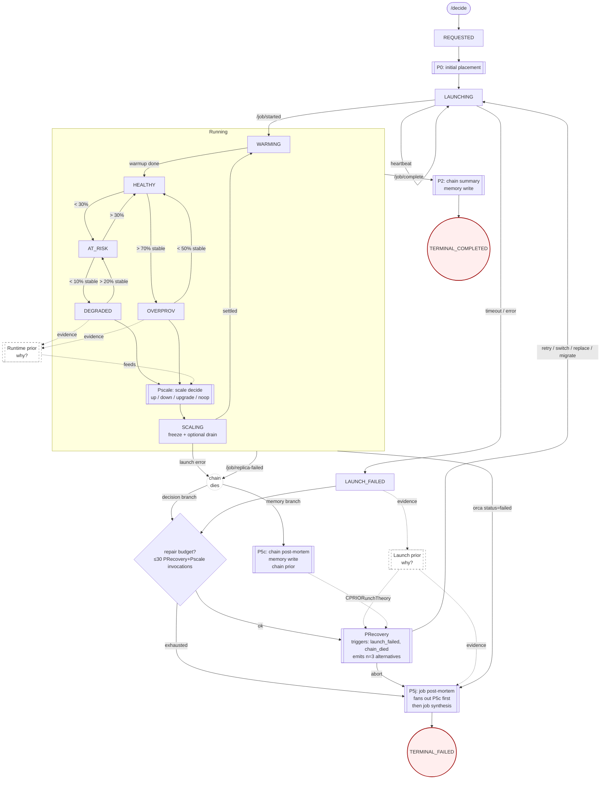

# Koi Harness Architecture v0

**Goal:** migrate Koi's production agent loop from two broad prompts into a small FSM-driven harness that precomputes evidence, presents some recommendations based on cost/slo and lets smaller local LLMs make reliable decisions while encouraging exploration/info-seeking but not mandatorily.

This document describes the target v0 architecture for the live Koi production path. It does not rely on the old ensemble path.

---

## 1. Why This Exists
Koi currently relies on a strong model to read large prompts, decide what tools to call, collect data, do arithmetic, reason about placement/runtime tradeoffs, and finally choose an action. That is workable with strong hosted models, but the production target is a local CPU-capable, heavily quantized LLM. Small local models can reason, but they are weaker at:

- long-context synthesis
- tool orchestration
- remembering API shapes
- doing multi-step arithmetic reliably
- staying inside action policy under pressure

The harness inverts the responsibility:

- deterministic code fetches and compresses evidence
- deterministic code generates feasible recommendations
- deterministic code validates and executes actions
- the LLM reasons over the prepared packet, and can optionally choose to explore.
- the LLM HAS to ultimately generate, using structured generation to, generate the main configuration that we wanna launch + the alternatives that come along with it.

Deterministic code here are actual python functions from the tools themselves present in the V0 non-harness agentic codebase 
Functions like query_memory(), query_perfdb(), get_gpu_physics() are something which, in the V0 architecture was called again and again by the LLM agent. However, making that data available and spoon-fed to an agent seems like the way to go for an FSM like harness design.

The LLM is not reduced to a picker bot. It may inspect packet details, request comparisons, ask for counterfactual menus, and instead of choosing from the recommendations, it ALWAYS has to generate (using structured generation) the final recommendation. The harness constrains what is provided to the LLM and not how the LLM thinks / generates. In fact, the agent is encouraged to reason over a prior (if a chain died/over provisioning) -> and generate a fallback configuration that should launch. We will talk more about this "Theory" thing in the doc below. 

For falling back, it always should add a chain before optionally killing something. That is the scale up / scale down behavior. 

What is in scope for this change?
Here are some states/prompts that need to be made - 
- P0 (initial decision);
- PRecovery (if chain died - try to recover it);
- P5c (if chain died / finished - summary of it);
- P5j (if whole job died / failed to launch with all alternatives - summary of it)
- Single-Per-Job Repair Budget - **Every PRecovery or Pscale invocation that picks a real repair action deducts one point from the per-job repair budget**. `noop` does NOT deduct — if the agent decides "do nothing this tick," no repair happened so nothing is charged. P0 is exempt entirely. Budget is checked before the prompt; if exhausted, the prompt is skipped and the job routes to P5j → `TERMINAL_FAILED`.
- Recent Failure Awareness - The recommendations provided to the LLM, in the packet, will also have when did this sort of a deployment last fail (cold-delay sort of a thing)

Every time the system has to explain a failure, the agent generates a structured Theory grounded in Orca's raw failure code, the failed job's physics features, and recent memory. Theories are persisted next to decisions and outcomes so the system can learn over time which (theory → action → outcome) triples actually work. This is the foundation for a future causal graph.

### Two-Stage LLM Contract

Every decision phase (P0, PRecovery, Pscale, P5c, P5j) uses a strict **two-stage LLM contract**. The two stages never share a call.

- **Stage 1 — Exploration.** The agent reads the packet, calls read tools, requests counterfactuals, and reasons freeform. No structured-output enforcement. The output of stage 1 is a message history, not a config. Implemented as `pydantic-ai` `Agent.iter()` with tools enabled and no `output_type`.
- **Stage 2 — Commit.** A separate LLM call with **zero tools**, the stage 1 message history as context, and `strict: true` JSON-schema enforcement. This call's only job is to emit the final `ChosenAction` (theory + plan + 3 alternatives). Implemented as `pydantic-ai` `NativeOutput(ChosenAction)` against the provider's native `response_format: json_schema` API.

Mixing tool use and strict structured output in one call is unreliable on most providers and confuses weak local models — the model gets stuck choosing between calling read tools and emitting the output-tool. Splitting the two removes the ambiguity. Stage 1 is "think and explore." Stage 2 is "commit, no second-guessing, no tools."

For v0 (MVP), stage-2 schema validation failure is **fatal**: the program halts. No retries, no deterministic fallback. Production hardening (retry policy, graceful degradation) is deferred.

### What is `action_id`?

`action_id` is **a label the LLM mints for each config it emits** in Stage 2, so that detail sections, tools, and downstream records can correlate evidence with the specific emitted config. It is not a key into a deterministic action catalog — there is no catalog. The LLM picks any short identifier (e.g. `"primary"`, `"alt-a100-spot"`, `"alt-l40s-onprem"`) and the harness uses it purely as a join key. Suggestions in the packet may also carry their own `action_id`s for the same correlation purpose, but the LLM is never required to reuse a suggestion's `action_id` — it generates fresh ones for each emitted config.

---

## 2. Design Principles

### Max Work, Min States
The FSM should stay small. Cluster reality can be messy, but most messiness should live in packet fields, guards, and evidence annotations, not new top-level states. Use durable states for lifecycle and health. Use flags for everything else.

### Spoonfeed Evidence, Preserve Reasoning
The LLM should not have to discover basic facts every time. The packet should already contain:

- workload/SLO/cost constraints
- current runtime state
- PerfDB evidence
- memory outcomes and diagnoses
- model/GPU physics
- quota and beta priors (for availability)
- recent failure signals from fresh failures
- possible feasible actions
- failure theory (from launch/running/chain failures)

The LLM can still ask for more detail, but the default path should require zero external info-seeking.

### Bound Execution, Not Thought
The LLM may reason freely, inspect detail sections, compare options, and disagree with the provided options. It should at the end of the day generate the cluster specifications (TP/PP etc.) instead of selecting from options. The final results can be validated deterministically though.

### Production Path Only
This architecture targets the live path:

- `koi/server.py`
- `koi/agent.py`
- `koi/monitor.py`
- `koi/runtime_state.py`
- `koi/resource_ledger.py`
- `koi/tools/*`
- `koi/runtime_policy.py`
- `koi/costing.py`

The old ensemble path is out of scope.

### One Failure Per Failure Class
Launch failure and chain death are the same business question: "we just lost a chain; what next?" They share one recovery loop (PRecovery) and one budget. We do not duplicate prompts or budgets per failure subtype. 

### Memory is Both Sides
Memory must be written on success (chain summary) and on failure (post-mortem). A system that only writes failure post-mortems will eventually believe everything fails.

---

## 3. Final v0 FSM

This is the business-level FSM for v0. Do not expand it unless a condition is truly durable and operationally distinct.



The mermaid is a lil older than what all we have, so don't worry about it too much, just here to help you guide through the whole thing.

Each phase that handles a failure generates a one-sentence free-form Theory explaining *why*: LaunchTheory (PRecovery on launch_failed), RuntimeTheory (Pscale on degraded/overprov), ChainTheory (P5c on chain_died). Theories are natural-language hypotheses, not enums — the agent says it in its own words. Every attempt has a theory aligned with it.

The agent generates it whenever the system has to explain "why did something just go wrong?" The agent is creative, but the output is typed.
+----------------------------+-------------------------+---------------------------------------------------------------+
| Phase                      | Theory generated by     | Inputs to the theory                                          |
|                            | agent                   |                                                               |
+----------------------------+-------------------------+---------------------------------------------------------------+
| PRecovery (launch_failed)  | LaunchTheory            | Orca's launch failure category + model physics + memory of    |
|                            |                         | same-model launches                                           |
+----------------------------+-------------------------+---------------------------------------------------------------+
| Pscale (DEGRADED/OVERPROV) | RuntimeTheory           | Telemetry + GPU physics + prediction provenance               |
+----------------------------+-------------------------+---------------------------------------------------------------+
| P5c (chain_died)           | ChainTheory             | Orca's reason_code + failed chain's physics features +        |
|                            |                         | memory of same-scope deaths                                   |
+----------------------------+-------------------------+---------------------------------------------------------------+

Every Theory is persisted with (inputs, theory, action_taken, outcome), and over time you mine it.

### States
There are two kinds of states
1 - Cluster States- it is a fact about the cluster (what is alive)
2 - LLM specific states (which carry a certain prompt with them)

| State | Meaning |
| --- | --- |
| `REQUESTED` | `/decide` accepted and parsed. | (P0)
| `LAUNCHING` | Launch requested, heartbeat/start/failure pending. | (not an LLM State)
| `LAUNCH_FAILED` | Launch path failed before serving (if all alternatives fail to launch / install failed / OOM) | (PRecovery)
| `WARMING` | Job or replica started, metrics not stable yet. | (not an LLM State)
| `HEALTHY` | Running with enough SLO headroom. | (Deadband + PScale)
| `AT_RISK` | Running below healthy threshold but not yet degraded. | (Deadband + PScale)
| `DEGRADED` | Stable falling-behind condition. | (Deadband + Pscale)
| `OVERPROV` | Stable over-provisioned condition. | (Deadband + Pscale)
| `SCALING` | Scale/kill/migrate action in flight (After PScale is called); monitor freeze applies. | (not an LLM state) 
| `REPLICA_RECOVERY` | A dead chain was diagnosed and recovery decision is needed. | (PRecovery)
| `TERMINAL_COMPLETED` | Job completed. | (P2 in the diagram - Save Chain Summary Per Job)
| `TERMINAL_FAILED` | Job failed after post-mortem. | (P5j or P5c If Chain Died or Job Died.)


Precovery takes care about it's parameters as evidence data for the theories to form
- failed launch attempts, startup logs, quota/capacity/OOM
- Theory Developed from the Prior Evidence is - Why did Startup Fail? 
- And the actions are followed like this - 
# pseudocode, you need to determine what to implement
get_launch_alternatives()
check_fresh_quota()
filter_models_by_physics_vectors()
rank_by_workload_and_gpu_physics(i_o, memory_bandwidth, sm)
add_tool_definitions_to_the_prompt()
generate_more_alternatives_using_agent()
guardrails() # model fits or not 
- The prompt needs to think from the perspective of "oh the availability is not there"/"vllm-param/version failed" etc...
- Two paths when this gets triggered - When Spots Pre-Empt or Machine Dies or all alternatives fail to launch.


### Not States

These should be packet fields, guards, reasons/hypothesis/theory, or evidence that will be provided in a JSON:

# Group 1: Packet inputs (agent reads these)
- quota found/not found
- under/over cost ceiling
- planned vs actual config drift
- exact PerfDB vs proxy vs analytical source
- fresh spot preemption signal
- recent no-capacity failure signal
- tenant id

# Group 2: Guards (control flags, not durable state)
- retry budget remaining/exhausted
- action in flight / cooldown
- metrics stale
- evidence quality flag

# Group 3: Theory outputs (agent emits these, persisted next to decisions)
- LaunchTheory — launch theory (PRecovery on launch_failed)
- RuntimeTheory — runtime theory (Pscale)
- Chain Theory - 

# Group 4: Evidence labels (annotations on suggestion cards)
- recent failure recommendation strings

ClusterStates according to me are - 

class ClusterState(str, Enum):
    REQUESTED          = "requested"          # /decide accepted
    LAUNCHING          = "launching"          # Orca submit in flight
    WARMING            = "warming"            # model_ready signal, metrics not stable
    HEALTHY            = "healthy"            # SLO headroom OK
    AT_RISK            = "at_risk"            # below healthy band, no action
    DEGRADED           = "degraded"           # stable below SLO
    OVERPROV           = "overprov"           # stable above headroom band
    SCALING            = "scaling"            # action in flight, monitor frozen
    TERMINAL_COMPLETED = "terminal_completed"
    TERMINAL_FAILED    = "terminal_failed"
    
And what I really see in LLMStates are - 

class DecisionPhase(str, Enum):
    P0          = "p0_initial_placement"
    PRECOVERY   = "precovery"          # launch_failed or chain_died
    PSCALE      = "pscale"
    P5C         = "p5c_chain_postmortem"
    P5J         = "p5j_job_postmortem"
    P2          = "p2_chain_summary"   # success-side summary

What kicks each DecisionPhase

| DecisionPhase | Trigger                                | Agent reads                                 | Agent emits          | Persists                                           |
|---------------|----------------------------------------|---------------------------------------------|----------------------|----------------------------------------------------|
| P0            | REQUESTED                              | job_context, memory, perfdb, physics        | (no theory)          | decision row                                       |
| PRecovery     | LAUNCH_FAILED or /job/replica-failed   | failure_context + (P5c diagnosis  )         | action + theory if no diagnosis exists yet | decision row + budget−1      |
| Pscale        | DEGRADED or OVERPROV                   | telemetry, physics, perfdb, memory          | RuntimeTheory               | decision row + theory_blob + budget−1 (skip on `noop`) |
| P5c           | /job/replica-failed                    | Orca reason_code + chain physics + memory   | P5c diagnosis (theory shape) | outcome row + cooloff signal + theory_blob |
| P5j           | terminal failure / budget exhausted    | all decision/theory rows + final outcome    | job-level theory     | outcome row + theory_blob                          |
| P2            | /job/complete success                  | observed metrics + decision history         | (none; optional short reflection) | chain_summary row                     |
---

## 3.1 - Vocabulary Map
The first version and the second versions were VibeCoded, hence it is high time we freeze the naming scheme such that we don't confuse things ever - 

+---------------------+-------------------------------------------------------------+----------------+
| FSM diagram name    | Code module                                                 | Doc symbol     |
+---------------------+-------------------------------------------------------------+----------------+
| Initial Placement   | koi/harness/p0.py                                           | P0             |
| PRecovery           | koi/harness/precovery.py (was p1.py + p4.py)                | PRecovery      |
| Pscale              | koi/harness/pscale.py                                       | Pscale         |
| Chain Post-Mortem   | koi/harness/chain_postmortem.py (was p5c.py)                | P5c            |
| Job Post-Mortem     | koi/harness/job_postmortem.py (was p5j.py)                  | P5j            |
| Chain Summary       | koi/harness/p2.py (NEW)                                     | P2             |
| DeadBand            | koi/monitor.py hysteresis bands + anti-windup               | DeadBand       |
| ResourceMap         | koi/resource_ledger.py (rename to resource_map.py)          | ResourceMap    |
| JobID               | job_id                                                      | JobID          |
| ChainID             | chain_id (NEW first-class column)                           | ChainID        |
+---------------------+-------------------------------------------------------------+----------------+

## 4. High-Level Harness Flow

Every LLM decision follows the same outer pipeline:

Here is one example - 
Trigger: DEGRADED detected for job=J1
  -> StateReducer:       cluster=DEGRADED phase=PSCALE
  -> PacketBuilder:      build_runtime_context(J1) + recent_failure_signals
  -> SuggestionBuilder:  candidates ranked by physics / certainty (advisory)
  -> PromptTemplate:     pscale.j2 (state=DEGRADED, packet=..., suggestions=...)
  -> LLM Stage 1:        Agent.iter() with read tools enabled, no output_type.
                         Reads packet, calls read tools, reasons freeform.
                         Produces message_history.
  -> LLM Stage 2:        Separate call. Zero tools. NativeOutput(ChosenAction)
                         with response_format=json_schema strict=true.
                         Takes Stage 1 message_history as context.
                         Emits ChosenAction(theory=RuntimeTheory(...),
                                            alternatives=[3]).
                         On schema validation failure: HALT (MVP).
  -> Feasibility check:  on every emitted config (VRAM / TP / PP / market / cooloff)
  -> Executor:           Orca scale-up submit
  -> Recorder:           decisions row + theory_blob + budget −1

| Stage | Responsibility |
| --- | --- |
| `StateReducer` | It is a trigger classifier, finds you what FSM state does this belong to. |
| `PacketBuilder` | Pull deterministic evidence into a transition packet. By Packet - I mean a couple of JSON Dicts that can be passed to the LLM in a structured format. |
| `PriorReasoner` | Agent stage. Reads the packet, runtime telemetry, physics, and
                    memory; emits a one-sentence free-form RuntimeTheory describing *why* the transition
                    likely happened. The agent is encouraged to be creative — the prior
                    is NOT deterministic. Only fires for DEGRADED / OVERPROV (Pscale).
                    In future versions, multi-agent debate over priors will feed a
                    causal graph mapping (prior → action → outcome) so the system
                    can learn which beliefs predict which fixes. |
| `SuggestionBuilder` | Pre-filter infeasible options and show some suggestions to the Agent. This is a Guardrail even before it goes to the LLM.|
| `PromptTemplate` | Render a small state-specific prompt from the packet. "Objective is to handle failure -> here are resources..... and some recommended options. Please generate the final configuration"|
| `LLM Stage 1` | Exploration (all phases). `pydantic-ai` `Agent.iter()` with read tools enabled and no `output_type`. Model reads the packet, calls read tools, reasons freeform. For P0/PRecovery/Pscale, output is a message_history passed to Stage 2. For P5c/P5j, the final assistant text is the phase output (chain theory / job narrative); no Stage 2. |
| `LLM Stage 2` | Commit (P0, PRecovery, Pscale only). Separate `pydantic-ai` call with **zero tools** and `NativeOutput(ChosenAction)` (`response_format=json_schema, strict=true`). Takes Stage 1 message_history as input context. Emits the typed `ChosenAction`. Schema validation failure halts the program (MVP). P5c and P5j skip Stage 2. |
| `Guardrail` | Formerly Validator - Guardrail checks the output shape, safety, and compliance with the Quota Map. If the LLM Hallucinated, and the quota/availability changed, it is just some simple IF ELSE conditions |
| `Executor` | Map action id to current production operations. |
| `Recorder` | Write decisions, outcomes, diagnoses, recent failure signals, and events. |

---

## 5. State Ownership in v0 

Do not add a second authoritative FSM database in v0. Derive state from current production sources. We will make that DB in the next version. 

| Harness State | Existing Source |
| --- | --- |
| `REQUESTED` | `/decide` request path. |
| `LAUNCHING` | `MonitoringLoop._pending_launches` and runtime `pending_launches`. |
| `WARMING` | `JobTracker.status == warming_up`. |
| `HEALTHY` | `JobTracker.status == on_track`. |
| `AT_RISK` | `JobTracker.status == at_risk`. |
| `DEGRADED` | `JobTracker.status == falling_behind`. |
| `OVERPROV` | `JobTracker.status == over_provisioned`. |
| `SCALING` | `JobTracker.action_in_progress` / `action_freeze_until`. |
| `REPLICA_RECOVERY` | `/job/replica-failed` handler context. |
| `TERMINAL_COMPLETED` | `/job/complete`. |
| `TERMINAL_FAILED` | launch/job failure after post-mortem. |

Explicit FSM tables can be added later for audit/replay if needed, but they are not required for v0. Early persistence should focus only on targeted data:

- retry budgets
- recent failure signals
- optional packet/choice audit rows if debugging requires them

---

## 6. New Module Layout

```text
koi/harness/
  __init__.py
  schemas.py
  fsm.py
  controller.py
  packets.py
  suggestions.py
  prompts.py
  reasoner.py
  guardrail.py         # action_id guardrail, formerly part of validator.py, not sure if it needs its own file
  config_validator.py  # raw config validation, split from validator.py
  executor.py
  cooloff.py
  p0.py
  precovery.py         # launch recovery, was p1.py plus merged p4.py logic
  pscale.py
  p2.py                # chain summary logic (once chain finishes successfully)
  chain_postmortem.py  # chain (P5c) diagnosis logic
  job_postmortem.py    # job (P5j) diagnosis logic
  budget.py            # repair budget counter
  theories.py          # LaunchTheory, RuntimeTheory, and theory builders
  resource_map.py      # resource accounting (renamed from resource_ledger.py) - not really needed to modify right? 
```

### Suggested Responsibilities

| Module              | Responsibility |
|---------------------|------------------------------------------------------------------------------------------------------------------------------------------------------------------------------|
| `schemas.py`        | Pydantic models for packets, action options, tools for exploration, choices (suggestions), prompt outputs.                                                                   |
| `fsm.py`            | State reducer and transition helpers. Derived-state only in v0; no DB, just per-job in-memory state logic.  # i think it can be moved with controller.py                     |
| `controller.py`     | Orchestrates packet → suggestions → prompt → reasoner → guardrail/config validation → execute. Primary agent system runner.                                                  |
| `packets.py`        | Shared packet-building utilities and detail section management.  # please define packets and section management more                                                         |
| `suggestions.py`    | Produces suggestions for the LLM, using PerfDB/memory. Used to present plausible and successful historical sample actions.                                                   |
| `prompts.py`        | System prompt and micro-prompt templates for each scenario/state.                                                                                                            |
| `reasoner.py`       | Two-stage LLM invocation. Stage 1: `Agent.iter()` with read tools enabled, no `output_type` (free exploration over the packet). Stage 2: separate call with zero tools and `NativeOutput(ChosenAction)` (`strict:true` JSON schema), taking Stage 1's message_history as input. The two stages never share a call. |
| `guardrail.py`      | Validates the selected `action_id`. # i think you can fuse guardrail and config validator               |
| `config_validator.py` | Validates generated configs for shape/safety/compatibility. Ensures output can be safely executed.                                                                         |
| `executor.py`       | Deterministic mapping from action_id to production operation. Executes the chosen actions.  # this is where exploration / action tools are called                                              |
| `cooloff.py`        | Handles recent failure signals, timestamps, and brief resource cooling logic on failed chains.                                         |
| `p0.py`             | Initial placement: packet, suggestion, prompt logic.                                                                                   |
| `precovery.py`      | Launch and replica recovery logic (merged p1 logic and former p4 replica recovery).                                                    |
| `pscale.py`         | Runtime scale (up/down/upgrade/noop) logic.                                                                                            |
| `p2.py`             | Chain summary generation, memory writes (terminal summary).                                                                            |
| `chain_postmortem.py` | P5c: chain-level postmortem and diagnosis logic.                                                                                     |
| `job_postmortem.py`   | P5j: job-level postmortem and diagnosis logic, including fan-out to chain_postmortem.                                                |
| `budget.py`         | Repair/retry budget tracking and decision.                                                                                             |
| `theories.py`       | Defines LaunchTheory, RuntimeTheory schemas and their construction helpers/builders.                                                                                         |
| `resource_map.py`   | Resource accounting, available and used pool bookkeeping (formerly koi/resource_ledger.py).    # again im not sure if we need to edit existing logic/file                    |

Each prompt file should share logic and structure via common helpers where possible.

---

## 7. Core Schemas

### TransitionPacket

One shared outer packet shape should feed all prompts.

```python
class TransitionPacket(BaseModel):
    packet_id: str  # not necessarily required (for future when we have DB)
    job_id: str
    tenant_id: str = "default"
    state: ClusterState  # current state of the job/chain (matches §3 FSM enum)
    phase: DecisionPhase  # prompt/transition phase (DecisionPhase, not TransitionType)
    job_context: dict  # the original job-level details
    runtime_context: dict = {}  # live fleet state
    failure_context: dict = {}  # included on raw failure as well as post-mortem
    policy_context: dict = {}
    evidence_summary: dict  # prior made by the LLM
    action_options: list[ActionOption]  # list of up to 3 options (n=3 contract)
    detail_sections: dict[str, Any]
    guards: dict[str, Any]
```

```python
job_context = {
    "job_id": "mo-qwen-123",         # Koi side ID
    "group_id": "mo-qwen-123",       # Orca side ID
    "decision_id": "dec-abc123",     # Koi Internal ID per decision
    "parent_decision_id": "dec-root",# created by koi for that JOB Group
    "model_name": "Qwen/Qwen3-32B",
    "avg_input_tokens": 512,
    "avg_output_tokens": 512,
    "num_requests": 5000,
    "total_tokens": 6_000_000,
    "slo_deadline_hours": 2.0,
    "objective": "cheapest",
    "cost_roofline_usd": 25.0,       # from user, not from the roofline analysis model that's in LLMPlacementSolver
    "preferred_market": "spot",      # from user
    "quantization": "fp8"            # user preference, often disabled for most cases
}

# or

job_context = {
    "job_id": "mo-qwen-123",
    "parent_decision_id": "dec-original",
    "model_name": "Qwen/Qwen3-32B",
    "slo_deadline_hours": 2.0,
    "objective": "cheapest",
    "original_config": {
        "gpu_type": "L40S",
        "tp": 4,
        "pp": 1,
        "dp": 1
    }
}
```

### ActionOption (suggestion shape)

Each `ActionOption` is a **deterministic suggestion** built by the packet builder and shown to the LLM as advisory ranking input. The LLM is not required to pick one — it always generates its own configs in Stage 2. The `ActionOption` shape is just a labeled, evidence-annotated candidate.

```python
class ActionOption(BaseModel):
    action_id: str            # suggestion-side label minted by the packet builder; used as join key for detail sections (e.g. "physics:<action_id>")
    action_type: str
    summary: str
    rank: int
    valid: bool
    hard_feasibility: dict
    performance: dict
    physics: dict
    evidence: dict
    availability: dict
    cost: dict
    risk: dict
    detail_refs: list[str]
```

### LaunchTheory

One-liner string hypothesis about launch failure, rationale, or context.

```python
class LaunchTheory(BaseModel):
    hypothesis: str  # natural language hypothesis: succinct, one-liner
    confidence: float  # 0.0–1.0, expected probability/confidence
    evidence: str  # supporting facts/trace
```

### RuntimeTheory

One-liner string hypothesis about runtime anomaly/failure.

```python
class RuntimeTheory(BaseModel):
    hypothesis: str  # natural language hypothesis: succinct, one-liner
    confidence: float
    evidence: str
```

### RepairBudget

Tracks repair budget. The unit is **a PRecovery or Pscale invocation that produced a real repair action**. Pscale `noop` does NOT count. P0 does not count. Orca submits and started chains do not count separately.

```python
class RepairBudget(BaseModel):
    cap: int                # KOI_MAX_CHAIN_ATTEMPTS, default 30
    used: int               # count of repair actions taken so far (PRecovery + non-noop Pscale)
    remaining: int
    consumed_by: list[str]  # ordered phase names: ["precovery", "pscale", "pscale", ...]
```

### ChosenAction (Stage-2 emit shape)

The final LLM output, emitted by Stage 2 (`NativeOutput(ChosenAction)`, `strict:true`). Generated freshly by the LLM — never picked from `ActionOption`s. The LLM has full authority to use the packet's evidence or propose its own valid plan.

```python
class ChosenAction(BaseModel):
    action_id: str            # LLM-minted label for the emitted config (e.g. "primary", "alt-l40s-spot"); used to correlate this emit with downstream records (decisions row, theory_blob, outcomes)
    confidence: float
    rationale: str
    evidence_used: list[str]  # action_ids of suggestions or detail-section keys the LLM cited in Stage 1
    theory: LaunchTheory | RuntimeTheory | None = None
    alternatives: list[Alternative]  # length = 3, ordered by $/token ascending
```

`why_not_top_choice` and `requested_more_context` from earlier drafts are removed: the LLM is not picking, and Stage 2 has no tools so it cannot request more context anyway.

### Alternative

Each alternative is one homogeneous group: one config plus the number of identical chains to attempt. There is no nested "groups inside a plan" — the schema is flat.

```python
class Alternative(BaseModel):
    alternative_id: str               # static, position-based label assigned by Koi after Stage 2: "alt_0" (primary), "alt_1", "alt_2". Not emitted by the LLM.
    config: dict                      # full engine + GPU + market + region spec
    replica_count: int                # how many chains of this config to attempt
    predicted_tps_per_chain: float | None  # Koi's estimate; None when unknown
```

---

## 8. Packets Always Visible to the Agent

Each packet contains two evidence layers.

### Theory / Fact-Based Features

These features are always visible to the prompt, and are intended to be short and decision-ready. (A future orchestration or policy engine may apply its own rules to these per-cluster, but for now their set is fixed.) The following are considered MUST-have features:

- hard feasibility
  - `vram_fit`
  - `vram_headroom_gb`
  - `tp_heads_valid`
  - `pp_layers_valid`
  - `kv_heads_per_tp_shard`
  - `crosses_node_boundary`
  - `capacity_ok`
  - `runtime_supported`
- performance
  - `predicted_tps`
  - `required_tps`
  - `meets_slo`
  - `prediction_source`
  - `prediction_confidence`
- physics
  - `bandwidth_per_param`
  - `flops_per_param`
  - `roofline_decode_tps`
  - `io_ratio`
  - `gqa_ratio`
- evidence
  - `proxy_model`
  - `proxy_distance`
  - `memory_successes`
  - `memory_failures`
- availability
  - `live_quota`
  - `beta_launch_success_pct`
  - `recent_no_capacity_failures`
  - `recent_same_scope_failure`
  - `last_failure_age_min`
  - `recent_failure_reason`
- cost
  - `cost_per_hour`
  - `projected_total_cost_usd`
  - `under_roofline`

### Detail Sections
# have to think a little here before jumping through

The detail sections store rich evidence that the LLM can inspect when needed. This is where the 130+ PerfDB/memory variables belong.

Examples:

```text
physics:<action_id>
perfdb_exact:<action_id>
perfdb_proxy:<action_id>
memory_success:<action_id>
memory_failure:<action_id>
quota:<action_id>
recent_failures:<action_id>
runtime_metrics:<action_id>
```

By default, the LLM does not receive all detail sections up front. It is given only section references, and may use read tools to pull deeper context as needed.

### Theory Output
When the agent makes a decision, it emits a structured theory (such as `RuntimeTheory`) back into the packet. This theory output is used downstream—for example, feeding Pscale’s next decision via memory. The theory acts as a concise hypothesis about runtime anomalies or decisions, carrying forward critical reasoning and evidence for subsequent phases.


---

## 9. Physics Strategy

Physics is first-class deterministic evidence. It should not be left for the LLM to dig into. Everytime, there is any kind of a decision that the LLM Agent needs to make it should follow the following framework. 

All packet builders should do this - 

1. Fetch model features through `koi.tools.physics.get_model_features()` for the model we are trying to deploy. 
2. Compute the physics vector for the requested model. An example is shown below

// For Qwen/Qwen2.5-72B-Instruct:
//
//   physics_vector = {
//     "params_billion": 72,
//     "model_size_gb": 140,            // Model file size
//     "gpu_bandwidth_gbps": 2.4,       // Candidate GPU
//     "gpu_tflops_fp16": 240,
//     "bandwidth_per_param": 0.033,    // Derived: memory bandwidth per model param
//     // ...other relevant features
//   }


3. Query exact PerfDB records first.
4. If exact coverage is sparse or absent, run physics-vector similar-model fallback with `find_similar_models()`.
5. Compute per-config features with `koi.model_features.compute_config_features()`.
6. Assign prediction source and confidence. (We are assigning a heuristic here)
7. Build option cards with physics summaries plus rich detail sections.

The heuristic can be designed in this way - 
- Memory verified (is the same run already done in the memory) - (physics_similarity)*0.9 
- Found exact workload in PerfDB - (physics_similarity)*0.8
- Found a close match using Physics - (physics_similarity)*0.7

physics_similarity should be a number that can be normalized between 0 and 1, and for the first 2 cases it will be closer to 1 and the third case will be less closer to 1. Since it is a vector distance between what we have vs what we have observed. 


---

## 9.5. Suggestions are NOT GROUND TRUTH, and LLM is not a card picker

PerfDB Exact matches should ALSO NOT be considered the ground truth. Even exact matches can drift due to vLLM version, CUDA/driver changes, model-serving changes, kernel changes, AMI/image changes, workload shape, or cloud hardware variance. The LLM may accept, modify, or reject suggestions after inspecting evidence, but ultimately it should generate the configuration itself using structured generation. Not just for the primary configuration, but also the alternatives that Koi provides to Orca, should also be generated by the LLM.

Determinism means reproducible evidence construction, safety validation, and execution mapping. It does not mean the current deterministic ranker owns the final placement policy.

The decision contract requires that the LLM outputs not only the primary recommendation, but also fully structured n=3 typed alternative configurations. These alternatives must be independently and explicitly generated, each with their own detailed reasoned spec and supporting evidence in the output, rather than merely an index or pointer to a suggestion. 


---

## 10. Recent Failure Evidence

Long-term beta priors are useful but too slow for fresh failure avoidance. Add short-horizon recent-failure evidence, not hard cooldown enforcement. It is more like a "time-stamp" and not really a hard timer. 

### Why

If `A100 spot us-east-1` was preempted minutes ago, the next decision should know that immediately. This is not just a long-term prior update; it is a fresh operational risk. However, v0 should avoid arbitrary rules like "block this for 30 minutes" because the failed scope may still be the only SLO-saving path. It is a "Soft-check" for the agent to not IMMEDIATELY generate the SAME configuration again.

### Scope

For spot/no-capacity failures, key recent failure signals by:

```text
gpu_type + instance_type + region + market
```

For OOM/performance-specific failures, optionally include (other than the above):

```text
tp + pp + dp
```

### Behavior

- `P5c` writes when a scope failed, why it failed, and what scope it applies to.
- The phases `P0`, `PRecovery`, `Pscale`, and `PRecovery (chain recovery)` (previously referred to as `P1` and `P4`) each incorporate recent failure evidence into their ranking process.
- Keep options valid unless they are truly infeasible (`no_quota`, invalid topology, confirmed unchanged OOM, etc.).
- Deterministically downrank same-scope recent failures instead of hard-blocking them.
- Surface the failure evidence directly on the card: `last_failed_at`, `age_minutes`, `diagnosis_code`, `same_scope`, and `recommendation`.
- Let the LLM choose a recently failed scope if it is still the only viable SLO-saving path.
- Do not globally blacklist a GPU family because one market/region/scope failed.

The persisted table's intended semantics are recent-failure signals and ranking evidence, and NOT rigid cooldown timers.

Example card annotation:
 
```json
{
  "recent_failure": {
    "same_scope": true,
    "last_failed_at": "2026-04-27T21:43:00Z",
    "age_minutes": 7,
    "diagnosis_code": "spot_preemption",
    "recommendation": "Prefer on_demand or another GPU if available"
  }
}
```

---

## 11. Prompt and Tool Policy

### Shared System Prompt

All micro-prompts should share a small system prompt:

```text
You are Koi's bounded decision agent. Start from the provided suggestions and evidence. The ranking is guidance, not a command. You may inspect packet details using the tools that are available to you. Additionally you may choose to explore as well and find more evidence for your decision / placement.
```

### Runner Behavior

Decision phases split into **two classes**, with different Stage-2 behavior:

| Phase | Stage 1 | Stage 2 |
|---|---|---|
| `P0`, `PRecovery`, `Pscale` | Yes (tools, freeform) | Yes — `NativeOutput(ChosenAction)`, strict JSON |
| `P5c`, `P5j` | Yes (read-only tools, freeform) | **No** — Stage-1 freeform text is the final output |

The reason for the split: P0 / PRecovery / Pscale produce *configs that get executed*, so they must commit through strict-JSON Stage 2. P5c / P5j are postmortem phases — they emit theories and narratives for memory, not configs. Forcing P5c / P5j through strict JSON would over-constrain a one-sentence freeform hypothesis with no value. They use Stage 1 only, and the text output is recorded as the chain/job theory + narrative.

**Stage 1 — Exploration (all phases)**
- `pydantic-ai` `Agent.iter()` with read tools enabled per the per-prompt tool gating below.
- No `output_type` set. The model produces freeform text/messages, not a typed object.
- `max_iterations=3` for `P0`, `PRecovery`, `Pscale`. `max_iterations=2` for `P5c`, `P5j`.
- For `P0`/`PRecovery`/`Pscale`, the output is a `message_history` passed to Stage 2.
- For `P5c`/`P5j`, the final assistant text **is** the phase output (recorded as `chain_theory` / job narrative). No Stage 2.

**Stage 2 — Commit (P0, PRecovery, Pscale only)**
- Separate `pydantic-ai` call. **Zero tools registered.**
- Uses `NativeOutput(ChosenAction)` so the underlying request goes out as `response_format={"type":"json_schema","strict":true,"schema":...}`.
- Takes Stage 1's `message_history` as input context. The packet is also re-attached so Stage 2 has the same evidence Stage 1 saw.
- `max_iterations=1`. Stage 2 has nothing to deliberate — it commits.
- **No deterministic fallback** and **no retries on validation failure** (MVP). If `pydantic-ai` cannot validate the response against `ChosenAction`, the program halts. Production hardening is deferred.
- **No menu-pick path.** The LLM always generates the final config; the system never substitutes a deterministic suggestion.

### Packet-Scoped Read Tools

Expose tools like:

```text
read_option_detail(action_id, section)
compare_options(action_ids, lens)
read_packet_section(section_id)
request_counterfactual(goal, constraints)
```

These tools let the LLM explore without forcing it back into raw global tool orchestration.

### Per-Prompt Tool Gating

All tools below fire **only in Stage 1**. Stage 2 has zero tools registered, always — it is a pure schema-constrained commit.

| Prompt      | Stage 1 Tools                                                |
|-------------|--------------------------------------------------------------|
| `P0`        | Packet read tools and quota detail. No action tools.         |
| `PRecovery` | Packet read tools, quota detail, failure/prior detail. Can choose to launch |
| `Pscale`    | Packet read tools, runtime detail, optional scale/kill escape hatch. |
| `P2`        | Read-only only, optional reflection.                         |
| `P5c`       | Read-only only.                                              |
| `P5j`       | Read-only only.                                              |

The default executor path should not require the LLM to call action tools directly.

---

## 12. Prompt-Specific Plans

There is already some code written in this repo. However, assume that it is wrong — here is what each stage needs to do.

Conventions used throughout §12:

- Deterministic steps prepare evidence for the agent.
- The agent always generates the final config via structured generation (per §1). Suggestions in the packet are advisory; there is no menu-pick path.
- All decision phases share the n=3 alternatives contract from §15 Phase 3.
- Failure-handling phases (PRecovery, Pscale) emit a one-sentence theory inside the same structured response as the plan — no separate "prior builder" stage. Theories are free-form text (`hypothesis: str`), not enum-typed.

### P0: Initial Placement

Triggered by `REQUESTED`.

Packet builder (deterministic):

- parse workload / SLO / cost constraints, fetch resources from ResourceMap.
- query memory outcomes + exact PerfDB; if neither hits, run physics-vector proxy fallback.
- score each candidate: `match% = (model_physics_match) * (gpu_physics_vector_match) * (io_match)`. Normalize TPS by DP.
- annotate every candidate with quota, priors, recent-failure signals, and `dollars_per_token_estimate`.

Plan shape:

- A plan is a list of exactly **3 ordered alternatives** (`ChosenAction.alternatives`, see §7), ranked cheapest-`$/token` first.
- Each alternative is one homogeneous group: `{alternative_id, config, replica_count, predicted_tps_per_chain}`. No nested groups inside a plan.
- For unknown models (no PerfDB / physics-fallback miss), `predicted_tps_per_chain` may be `None` — the gate then treats it as `required_tps` (one chain assumed sufficient).

Agent configuration generator:

The deterministic packet is passed to the agent. The agent always generates the final config via structured generation. The agent is encouraged to explore tools freely and reason; it does not pick from suggestions.

Example shape Stage 2 emits (LLM-generated fields are `config`, `replica_count`, `predicted_tps_per_chain` per alternative; the `alternative_id` is *not* emitted by the LLM — Koi assigns `alt_0` / `alt_1` / `alt_2` by position before forwarding to Orca):

```json
{
  "job_id": "job-abc123",
  "model_name": "Qwen/Qwen2.5-72B-Instruct",
  "alternatives": [
    {
      "alternative_id": "alt_0",
      "replica_count": 5,
      "config": {
        "gpu_type": "L40S", "tp": 4, "pp": 1,
        "region": "us-west-2", "market": "spot",
        "engine_config": { "tensor_parallel_size": 4, "max_num_seqs": 256, "gpu_memory_utilization": 0.9, "dtype": "auto" }
      },
      "predicted_tps_per_chain": 250.0
    },
    {
      "alternative_id": "alt_1",
      "replica_count": 2,
      "config": { "gpu_type": "A100", "tp": 4, "pp": 1, "region": "us-east-1", "market": "spot", "engine_config": { "...": "same shape" } },
      "predicted_tps_per_chain": 600.0
    },
    {
      "alternative_id": "alt_2",
      "replica_count": 1,
      "config": { "gpu_type": "H100", "tp": 4, "pp": 1, "region": "us-east-1", "market": "on_demand", "engine_config": { "...": "same shape" } },
      "predicted_tps_per_chain": 1400.0
    }
  ],
  "reasoning": "Cheapest spot L40s first; A100 spot mid-tier; H100 on-demand as last resort.",
  "required_tps": 2000.0,
  "predicted_total_cost": 25.0
}
```

Executor (Orca-owned alternative walk):

Koi's only job at launch time is to submit the menu and the goal. The walking, the gate, and the per-chain teardown are Orca's responsibility.

```text
# Koi side — one call, returns immediately.
orca.submit_launch(
    job_id            = job_id,
    required_tps      = chosen_action.required_tps,
    alternatives      = chosen_action.alternatives,    # 3 in order, cheapest first
)
# Koi now waits for webhooks. No loop, no per-group timeout, no continue/skip dialog.
```

Orca walks the alternatives in order. For each alternative, Orca fires every chain submit in parallel (one chain = one atomic launch attempt with `KOI_CHAIN_LAUNCH_TIMEOUT_S=300`). After **every chain resolution** (started or failed), Orca emits a per-chain webhook and re-evaluates the gate:

```text
contribution(chain) = chain.predicted_tps_per_chain  if not None  else  required_tps
total_predicted     = sum(contribution(c) for c in chains_started_so_far)
gate_satisfied      = (total_predicted >= required_tps)
```

In-flight chains within the current alternative are never cancelled by the gate — let them resolve naturally; bonus capacity is welcome. Once the current alternative fully resolves, Orca decides:

- `gate_satisfied` → stop. Don't launch the next alternative.
- otherwise → submit the next alternative.

When the loop ends (gate met, alternatives exhausted, or cancelled), Orca emits one `launch_complete` webhook with the final summary.

Koi reacts to `launch_complete`:

- `started_chains` empty → invoke PRecovery with `launch_failed`.
- `started_chains` non-empty → enter `WARMING`. If predicted aggregate is still below `required_tps`, Pscale handles the shortfall once telemetry stabilizes.

Key behaviors:

- **Per-chain launch, never per-alternative all-or-nothing.** If alternative 1 wanted 5 chains and 2 succeed + 3 fail, those 2 keep contributing toward the goal.
- **Gate observed continuously, skip boundary is per-alternative.** The gate is checked on every chain resolution, but the unit of "skip" is the next alternative — the current alternative always finishes its in-flight launches.
- **Bonus chains are fine.** If the gate is met after chain 2 of 5 in alternative 1, the remaining 3 still complete. Pscale can scale down later if it's truly excess.
- **No repair-budget consumption.** P0 is initial placement, not repair (§15 Phase 1).
- **Cancellation** via `orca.cancel_launch(job_id)` — see §13.

### PRecovery: Unified Failure Recovery

Triggered by `LAUNCH_FAILED` OR `/job/replica-failed`. One prompt, two triggers.

PRecovery always emits a one-sentence `LaunchTheory` inside its structured response, regardless of trigger. The theory is free-form text (a brief natural-language hypothesis, not a closed enum). The trigger only changes which inputs the theory sees:

- on `launch_failed`: theory inputs are Orca's `reason_code` + per-config attempt counts + model/GPU physics + memory of same-model launches. No P5c exists for launch failures.
- on `chain_died`: theory inputs include all of the above plus `P5c.diagnosis_code` + `P5c.chain_theory` + the dying chain's telemetry. P5c's output is one input to the theory, not a substitute for it.

#### PRecovery waits for P5c (chain_died trigger only)

P5c and PRecovery are launched in parallel on `chain_died` (see §3 FSM diagram). They run as concurrent tasks:

- **P5c task**: deterministic packet build → Stage-1 LLM call → emits `chain_theory` text → recorder writes outcome row.
- **PRecovery task**: blocks on a `wait_for(p5c_task, timeout=KOI_P5C_WAIT_S)` before its packet builder runs. Default `KOI_P5C_WAIT_S=30` (seconds).

Three outcomes:

1. P5c finishes within timeout → PRecovery's packet builder includes `P5c.diagnosis_code`, `P5c.chain_theory`, `P5c.failure_scope`. The agent has full failure context.
2. P5c times out → PRecovery proceeds without P5c data. The packet builder records `p5c_status: "timed_out"` and the agent is told explicitly: *"P5c is still running; no chain theory available yet — reason from telemetry only."* P5c continues running asynchronously and its output is written to memory when it eventually finishes; the next PRecovery invocation (or P5j synthesis) will see it.
3. P5c crashes → same as timeout. PRecovery proceeds without P5c data; the crash is logged but does not block recovery.

This is the contract: **PRecovery never blocks indefinitely on P5c**, but it does give P5c a bounded chance to provide useful context. `KOI_P5C_WAIT_S` is tunable; the default is conservative enough for a single LLM call to complete on a weak local model.

`launch_failed` does not trigger a P5c (no chain ever ran), so this wait does not apply.

Packet builder (deterministic):

- failed launch attempts: per-config counts and failure categories.
- beta priors and recent-failure signals; original decision context (model exact, PerfDB exact, proxy).
- model physics features and any Orca-provided run stats from failed startups.
- on `chain_died`: also `P5c.diagnosis_code`, `P5c.chain_theory`, `P5c.failure_scope` if P5c finished within `KOI_P5C_WAIT_S`; otherwise `p5c_status: "timed_out"` and proceed.
- candidate replacements annotated with quota, priors, recent-failure signals.

Agent configuration generator:

The agent emits one structured response containing both:

- a `LaunchTheory`: one-sentence free-form hypothesis (e.g. *"Spot capacity in us-east-1 dried up; same scope failed twice in the last 10 minutes"*) + `confidence` + supporting `evidence` text. No enum, no fixed vocabulary — the agent says it in its own words.
- 3 ordered alternatives in the same shape as P0 (see §7 `Alternative` and the §12 P0 example). The submission goes to Orca via the same `submit_launch` contract — Orca walks the alternatives, runs the per-chain launch + gate, emits per-chain webhooks and a final `launch_complete` (see §13).

Suggestions are advisory inputs to ranking. The agent generates configs from scratch.

Executor:

- same Orca contract as P0: `orca.submit_launch(job_id, required_tps, alternatives)`. Returns immediately; Koi awaits `launch_complete`.
- decrement the per-job repair budget by 1 **once per PRecovery invocation** that produces a real repair plan (retry / switch / replace / migrate) (§15 Phase 1). The decrement is for the repair event, not for any individual Orca submit — even if PRecovery launches multiple chains in one plan, that's still one repair event.
- PRecovery has no `noop` action — its trigger is always a failure that needs handling — so in practice every PRecovery invocation decrements once.
- check the budget **before** invoking the prompt. If the budget would go negative, skip PRecovery, route to P5j with reason `repair_budget_exhausted`, and transition to `TERMINAL_FAILED`.

### Pscale: Runtime Scaling

Triggered by `DEGRADED` or `OVERPROV`.

Pscale always emits a one-sentence `RuntimeTheory` inside its structured response, alongside the action plan. The theory is free-form text — a brief natural-language hypothesis, not a closed enum.

Packet builder (deterministic):

- runtime state: aggregate observed TPS, required TPS, time left, tokens remaining, current replicas.
- DeadBand state (action freeze / cooldown), cost projection vs `cost_roofline_usd`, recent-failure signals.
- GPU telemetry: cache usage, SM utilization, memory bandwidth, staleness, warmup status.
- model physics + prediction provenance.
- scale up/down/upgrade/noop suggestions (advisory; not picked verbatim).

Agent configuration generator:

The agent emits one structured response containing both:

- a `RuntimeTheory`: one-sentence free-form hypothesis (e.g. *"Observed TPS is 38% below predicted and KV-cache usage is 92% on both replicas — looks like KV-cache pressure, not capacity shortage"*) + `confidence` + supporting `evidence` text. No enum, no fixed vocabulary — the agent says it in its own words.
- a primary scaling action + 3 alternatives, each a fully typed action. Action shape:
  - **Scale up** (`add_alternative`): one `Alternative` (config + `replica_count`). Submitted to Orca as a 1-element `alternatives` list with `required_tps` set to the observed shortfall. Same `submit_launch` contract as P0 — Orca runs the per-chain launch and gate, emits webhooks, returns `launch_complete`.
  - **Scale down** (`remove_replica`): `{alternative_id: <existing>, count: 1}`. Removes one chain from an existing alternative-group (preferring sickest chain per `RuntimeTheory`). No Orca launch involved.
  - **Upgrade/migrate**: `add_alternative` of the higher-tier config followed by Pscale's next decision to `remove_replica` from the lower-tier alternative once the new chain is healthy. Two consecutive scale actions, not one combined op.
  - **Noop**: explicit "do nothing this tick" — useful when DeadBand says wait.

Suggestions are advisory. "Scale-up cheaper config" or "kill one replica" are hints, not commands. The agent generates the action from scratch.

Executor:

- enters `SCALING`
- preserves anti-windup freeze (DeadBand)
- returns to `WARMING` when settled
- on `add_alternative`: same `orca.submit_launch(...)` call as P0, with a 1-element `alternatives` list. Orca runs per-chain launch on that single alternative; closes with `launch_complete`.
- decrement the per-job repair budget by 1 **once per Pscale invocation that picks a real repair action** — `add_alternative`, `remove_replica`, or upgrade/migrate. `noop` does NOT decrement: if the agent decides "do nothing this tick," no repair happened, so nothing is charged. The decrement is per repair event, not per Orca submit.
- check the budget **before** invoking the prompt. If the budget would go negative, skip Pscale and route to P5j.

### P5c: Chain Post-Mortem

Triggered by `/job/replica-failed` (chain death) or scaling launch error. LLM phase. Runs in parallel with PRecovery's `chain_died` branch — P5c writes memory and emits the chain theory; PRecovery picks the replacement (and waits briefly for P5c — see "PRecovery waits for P5c" below).

**Stage 1 only.** P5c has no Stage 2: there's no config to commit, just a freeform one-sentence theory plus deterministic side-fields. Forcing strict JSON over a one-sentence hypothesis adds no value.

Packet builder (deterministic):

- chain config
- actual TPS before death if known
- recent metrics up to death
- Orca's `reason_code` (passthrough; see §10)
- market / region / instance
- previous memory context for the same scope

Stage 1 emits (final assistant text):

- a one-sentence free-form `chain_theory` hypothesis (e.g. *"KV-cache pressure on this topology — chain ran fine for 30 min then OOMed once max_model_len traffic spiked"*).

Deterministic side-fields (computed by the packet builder, not the LLM, then attached to the P5c output record):

- `diagnosis_code` — Orca's `reason_code`, passthrough (Orca's enum, not a Koi belief)
- `failure_scope` — cooloff scope key (structured)
- `event_at` — timestamp
- recent-failure signal fields: `last_failed_at`, `failure_scope`, `diagnosis_code`

Both `diagnosis_code` (Orca's word) and `chain_theory` (Koi's agent's word) become **inputs** to PRecovery's theory on the `chain_died` trigger. P5c does not replace PRecovery's theorizing.

Recorder:

- writes outcome diagnosis and chain_theory (text)
- updates availability priors when appropriate
- writes a recent-failure signal for fresh spot / no-capacity / OOM scopes

### P5j: Job Post-Mortem

Triggered by terminal job failure, repair-budget exhaustion, or abort.

**Stage 1 only.** Like P5c, P5j has no Stage 2 — it produces a freeform diagnosis and narrative, not a config. The Stage-1 final assistant text is the phase output.

Behavior:

- fan out `P5c` for any undiagnosed dead chains first
- consume LaunchTheory + RuntimeTheory + all P5c chain theories written for this job
- Stage 1 emits a one-sentence job-level diagnosis (free-form text) + a longer free-text narrative
- write job-level outcome and narrative
- transition cluster state to `TERMINAL_FAILED`

No action tools. P5j observes and records; it does not launch anything.

### P2: Chain Summary on Success

Triggered by `/job/complete` success path. Deterministic by default; an optional short LLM reflection is gated behind `KOI_HARNESS_PROMPTS=p2`.

Deterministic stats:

- observed TPS curve (avg, p50)
- cost per hour, total cost
- prediction error (signed delta vs P0's `predicted_tps`)
- warmup duration, runtime hours
- replicas during chain life
- final cluster state at completion
- list of Pscale actions applied to this chain

Optional LLM reflection (≤300 tokens, flag-gated):

- short free-text "what worked, what to remember" note
- not used for any action — purely for memory enrichment and the future causal graph

Recorder:

- writes a `chain_summary` row keyed by `(job_id, chain_id)`
- joinable against decisions and outcomes for `(plan → outcome)` mining
- closes the "memory is both sides" loop from §2

### Recent-failure ranking (shared policy)

All packet builders in §12 must consume recent-failure signals when annotating candidates:

- read active recent-failure rows for each candidate scope
- annotate with `last_failed_at`, `age_minutes`, `diagnosis_code`, `same_scope`
- downrank same-scope recent failures in P0, PRecovery, and Pscale candidate lists
- recently failed scopes stay valid unless they are otherwise infeasible — the agent may override when SLO requires it
- never globally blacklist a GPU family because one scope failed

This is a soft signal, not a hard cooldown. Rollout details live in §15.

---

## 13. Production Integration Points

### `koi/server.py`

Use the harness in these paths behind feature flags:

- `/decide` -> `P0`
- `/job/launch-failed` -> `P1` → `PRecovery`
- `/job/replica-failed` -> `P5c` (parallel) + `PRecovery`
- `/job/complete` -> `P2` chain summary
- terminal job failure -> `P5j`

Keep `_run_with_inbox()` unchanged. It already provides crash-safe event dedup.

### `koi/monitor.py`

Keep deterministic polling, hysteresis, trigger dedup, and anti-windup. Route `FALLING_BEHIND` and `OVER_PROVISIONED` through `Pscale` when the harness flag is enabled.

### `koi/agent.py`

Initially keep legacy paths. Add small flagged branches:

- `decide()` delegates to harness `P0` when enabled
- `handle_trigger()` delegates to harness `Pscale` for health triggers when enabled
- other triggers stay legacy until phases land

Later, after cutover, remove giant prompt builders and legacy parse logic.

### `koi/llm/runner.py`

Two-stage is the standard path, not a fallback. The runner exposes one method per stage:

1. **Stage 1** (`run()` today): `pydantic-ai` `Agent.iter()` with read tools registered and **no `output_type`**. Returns the message history. This is the freeform exploration step.
2. **Stage 2** (`run_typed()` today, rewired): a fresh `pydantic-ai` call with **zero tools registered** and `NativeOutput(ChosenAction)`. Takes Stage 1's `message_history` as input context. The pinned `pydantic-ai` version routes `NativeOutput` to OpenAI-compatible `response_format={"type":"json_schema","strict":true,...}` against OpenRouter (or any other OpenAI-compatible endpoint via `KOI_BASE_URL`). On schema validation failure the call raises and the program halts (MVP).

The existing `run()` / `run_typed()` skeleton in the repo is the foundation; the migration is to (a) drop `output_type` from `run()`, (b) switch `run_typed()` to `NativeOutput` mode with no tools, (c) thread `message_history` from Stage 1 into Stage 2.

### `koi/runtime_state.py`

Do not add full FSM tables in v0. Add only targeted persistence if needed:

- retry budget entries
- recent-failure entries (currently stored in the `cooloffs` table)
- optional packet/choice audit entries

### `koi/tools/memory.py`

Reuse existing decisions/outcomes/launch_attempts/availability_priors. Add targeted helpers only if current queries cannot retrieve recent failure/failure-scope data cleanly.  
Add a `chain_id` column and a `theory_blob` JSON column.

### Orca Integration

The Koi ↔ Orca contract for launches is intentionally narrow: **Koi declares the goal and the menu; Orca walks the menu, runs the gate, and reports outcomes via webhooks.** Orca owns the launch loop. Koi owns the goal and the post-hoc reaction.

#### Submission

One Koi → Orca call per launch event (P0 initial placement, PRecovery recovery, Pscale `add_alternative`):

```text
POST /submit/launch
{
  job_id,
  required_tps,                 # SLO target the launch must satisfy
  alternatives: [               # 3 ordered alternatives, cheapest $/token first
    {
      alternative_id,           # static position-based label ("alt_0", "alt_1", "alt_2"); assigned by Koi, used as join key
      config,                   # full engine + GPU + market + region spec
      replica_count,            # how many chains of this config to attempt
      predicted_tps_per_chain   # nullable; null → gate treats as required_tps
    },
    ...
  ]
}
```

Returns immediately with an ack. Koi does not block — it waits for webhooks.

#### Orca's loop

For each alternative in submitted order:

1. Fire all `replica_count` chain submits in parallel. Each chain is an atomic launch attempt with timeout `KOI_CHAIN_LAUNCH_TIMEOUT_S=300` (configurable per launch).
2. As each chain resolves, Orca emits exactly one webhook for it (`chain_started` or `chain_failed`) and re-evaluates the gate:

   ```text
   contribution(chain) = chain.predicted_tps_per_chain  if not None  else  required_tps
   total_predicted     = sum(contribution(c) for c in chains_started_so_far)
   gate_satisfied      = (total_predicted >= required_tps)
   ```

3. **In-flight chains within the current alternative are never cancelled by the gate.** Let them resolve naturally; bonus capacity is welcome.
4. When the current alternative fully resolves (every chain either started or failed):
   - if `gate_satisfied` → stop. Don't launch the next alternative.
   - else → submit the next alternative.
5. When the loop ends — gate met, alternatives exhausted, or cancelled — emit one `launch_complete` webhook with the final summary.

#### Webhooks

| Webhook | Trigger | Payload |
|---|---|---|
| `chain_started` | chain reached "model ready" | `job_id`, `chain_id`, `alternative_id`, `started_at`, `predicted_tps_per_chain` |
| `chain_failed` | chain failed to start (timeout, OOM, no-capacity, etc.) | `job_id`, `chain_id`, `alternative_id`, `reason_code`, `reason_text` |
| `launch_complete` | end of loop | `job_id`, `started_chains: [...]`, `failed_chains: [...]`, `total_predicted_tps`, `slo_satisfied: bool`, `cancelled: bool` |

`launch_complete` is the trigger for Koi's FSM transition:
- `started_chains` empty → invoke PRecovery with `launch_failed`.
- `started_chains` non-empty → enter `WARMING`. If `slo_satisfied=false`, Pscale handles the shortfall once telemetry stabilizes.

Per-chain webhooks fire as they happen and drive incremental state updates (each `chain_started` adds a chain to `JobTracker`; each `chain_failed` is recorded for memory and recent-failure signals).

#### Cancellation

```text
POST /submit/cancel-launch
{ job_id }
```

On cancel:
- No new alternatives are walked.
- In-flight launch attempts in the current alternative are torn down.
- Already-`chain_started` chains keep running — they're real cluster state. Koi can scale them down later via Pscale if needed.
- Orca emits `launch_complete` with `cancelled: true` and the partial summary.

Use cases: user cancels job, repair budget exhausted mid-flight, operator manual intervention.

#### Reason codes

Orca's `chain_failed.reason_code` is the source of truth for Koi's recent-failure signals and PRecovery theory inputs (see §10). Notable values to add for this contract:

```python
CHAIN_LAUNCH_TIMEOUT = "chain_launch_timeout"  # KOI_CHAIN_LAUNCH_TIMEOUT_S elapsed
LAUNCH_CANCELLED     = "launch_cancelled"      # tore down due to /cancel-launch
```

Standard pre-existing codes (`no_capacity`, `oom`, `vllm_init_failed`, `spot_preemption`, etc.) continue to apply.

---

## 14. Feature Flags

Recommended flags:

```text
KOI_HARNESS=0|1
KOI_HARNESS_PROMPTS=p0,precovery,pscale,p5c,p5j,p2      # updated: consistent phase naming, added p2, removed p1/p4
KOI_HARNESS_FAIL_OPEN=1
KOI_HARNESS_MODEL_PROFILE=weak|strong
KOI_HARNESS_MAX_SUGGESTIONS=8                           # renamed from KOI_HARNESS_MAX_MENU
KOI_HARNESS_N_ALTERNATIVES=3                            # NEW: strict n=3 contract for alternatives
KOI_MAX_CHAIN_ATTEMPTS=30                               # NEW: per-job repair attempt budget
KOI_CHAIN_LAUNCH_TIMEOUT_S=300                          # NEW: per-chain launch timeout for Orca's per-chain submits (P0 / PRecovery / Pscale add_alternative)
KOI_P5C_WAIT_S=30                                       # NEW: how long PRecovery waits for parallel P5c on chain_died before proceeding without it
```

`KOI_HARNESS_HETEROGENEOUS` is removed — every alternative is a single homogeneous group; no nested groups inside a plan.

---

## 15. Phased Execution Plan

Foundation-first: vocabulary and identity before contracts, contracts before behavior changes, behavior changes before cutover. Each phase is independently shippable behind its own flag.

| Phase | Lands | Primary test gate | Flag(s) |
|---|---|---|---|
| 0. Vocabulary + PRecovery merge | Rename `p1.py`+`p4.py` → `precovery.py`; rename `p5c.py`→`chain_postmortem.py`, `p5j.py`→`job_postmortem.py`, `resource_ledger.py`→`resource_map.py`; rename `_classify_status_with_hysteresis`→`_classify_status_with_deadband` (+ `DeadBand` wrapper). Mechanical only. | Full unit + sim suite green with no functional change. | — |
| 1. Chain identity + repair budget | Add `chain_id` column to `decisions`/`outcomes`/`launch_attempts`. Add `count_repair_actions(job_id)`. Replace `MAX_STARTUP_RETRIES`/`P1_RETRY_BUDGET`/`P4_RETRY_BUDGET` with one per-job cap. **Decrement once per PRecovery invocation, and once per Pscale invocation that picks a real action** (`add_alternative`, `remove_replica`, upgrade/migrate). Pscale `noop` does NOT decrement. P0 does not decrement. Budget is checked before the prompt fires; exhaustion → skip the prompt, route to P5j → `TERMINAL_FAILED`. | Sim invokes PRecovery 30 times for one job; 31st invocation is skipped and transitions to `TERMINAL_FAILED`. P0 does not consume budget. Pscale `noop` does not consume budget; Pscale `add_alternative` does. | `KOI_MAX_CHAIN_ATTEMPTS=30` |
| 3. n=3 alternatives + feasibility check | `ChosenAction` requires exactly 3 typed alternatives, validated by `pydantic-ai` `strict:true`. Feasibility checker runs **once** on every Stage-2 emitted config (VRAM / TP heads / PP layers / market availability / cooloff scope). **No retry loop, no deterministic fallback** — on infeasibility the phase fails hard: route to P5j → `TERMINAL_FAILED` with reason `generation_infeasible`. (Stage 2 already has `max_iterations=1` and no retries; Stage 1 doesn't emit configs, so there is nowhere to retry.) Apply to P0, PRecovery, Pscale. | Schema rejects `len < 3` / `len > 3`; feasibility check rejects bad VRAM/TP/PP; on infeasibility the job transitions to P5j → `TERMINAL_FAILED` with reason `generation_infeasible`. | `KOI_HARNESS_N_ALTERNATIVES=3`, `KOI_HARNESS_MAX_SUGGESTIONS=8` |
| 3.5. Two-stage commit | Refactor `koi/llm/runner.py` to enforce two-stage. **Stage 1**: `Agent.iter()` with read tools registered, **no `output_type`** (free exploration). **Stage 2**: separate call with **zero tools** and `NativeOutput(ChosenAction)` (`response_format=json_schema, strict=true`); takes Stage 1's `message_history` as input. The two stages never share a call. On Stage-2 schema validation failure the program halts (MVP — no retries, no fallback). Wire **P0, PRecovery, Pscale** to the two-stage runner (Stage 1 + Stage 2). Wire **P5c, P5j** to Stage 1 only — final assistant text is the phase output (chain theory / job narrative); no Stage 2 because there's no config to commit. | Stage 2 produces a schema-valid `ChosenAction` against `strict:true`; Stage 1 message history flows into Stage 2 for P0/PRecovery/Pscale; P5c and P5j produce text output without invoking Stage 2; running with `output_type` set in Stage 1 is rejected by tests; running with tools registered in Stage 2 is rejected by tests. | — |
| 4. Theories (Launch + Runtime) | Add `koi/harness/theories.py` with `LaunchTheory` + `RuntimeTheory`: `{hypothesis: str (one-sentence), confidence: float, evidence: str}`. Free-form, no enum. Extend `ChosenAction.theory` so theory + plan emit in one structured response (Stage 2). PRecovery emits on every trigger; Pscale emits on `DEGRADED`/`OVERPROV`. Persist as `decisions.theory_blob`. | Theory is a non-empty one-sentence string; round-trips through `theory_blob`; `(theory → action → outcome)` triples join cleanly. | — |
| 5. P2 chain summary on success | Add `koi/harness/p2.py: run_chain_summary(job_id, chain_id)`. Deterministic stats by default; optional LLM reflection ≤300 tokens behind flag. Wire into `/job/complete` success path. | Every successful chain has a `chain_summary` row. Memory queries return both success and failure rows for the same model class. | `KOI_HARNESS_PROMPTS=…,p2` (optional reflection) |
| 6. Per-chain launch + Orca-owned alternative walk | `ChosenAction.alternatives: list[Alternative]` of length 3 (flat, no nested groups). Koi calls `orca.submit_launch(job_id, required_tps, alternatives)` once per launch event; Orca walks alternatives in order, fires per-chain submits in parallel within each alternative, evaluates the gate after every chain resolution, and emits `chain_started` / `chain_failed` / `launch_complete` webhooks. Add `orca.cancel_launch(job_id)`. `Pscale.add_alternative` uses the same call with a 1-element list. | Per-chain timeout (chain that doesn't start in time is failed; alternative continues with remaining chains). Partial-alternative test (5 requested, 2 start, 3 fail; gate sees 2). Greedy alternative-skip (alternative 1's gate met → alternatives 2 and 3 not launched; in-flight chains in alternative 1 still finish). Zero-start across all alternatives → PRecovery (`launch_failed`). Cancel mid-flight → `launch_complete.cancelled=true`. Missing `predicted_tps_per_chain` treated as `required_tps`. | `KOI_CHAIN_LAUNCH_TIMEOUT_S=300` |
| 7. Cutover | Shadow mode → per-prompt cutover (`P0` → `PRecovery` → `Pscale` → `P5c` → `P5j` → `P2`). After one release cycle stable, delete the legacy giant-prompt path. | Parity tests green, Tier 3 sim parity, no safety regressions, weak-model quality near strong-model baseline. | `KOI_HARNESS=1` |

### Optional Follow-Ups (deferred)

Land only if v0 observability proves insufficient.

- **Persistent FSM tables** — explicit `decisions × cluster_state` audit/replay. Not needed while derived state from `JobTracker` + `MonitoringLoop` is healthy.
- **Multi-agent theory debate** — a second agent critiques the first's theory before the action call. Foundation for the causal graph; adds a second LLM hop.
- **Recent-failure run-stats ingestion** — Koi-side payload for Orca-provided failed-chain run stats. Useful when `reason_code` granularity is insufficient.

---

## 16. Testing and Verification

### Unit Tests
Do it for major functions inside every phase.


### Simulation

- strong-model parity run
- weak-model run with `xiaomi/mimo-v2-pro`
- launch failure → PRecovery scenario (LaunchTheory emission + n=3 alternatives)
- chain death → P5c (parallel) + PRecovery scenario, P5c finishes within `KOI_P5C_WAIT_S` → PRecovery sees `chain_theory` + `diagnosis_code`
- chain death → P5c (parallel) + PRecovery scenario, P5c slow → PRecovery times out the wait, packet records `p5c_status: "timed_out"`, agent proceeds without P5c data, P5c output still lands in memory asynchronously
- spot preemption recent-failure ranking scenario
- post-mortem coverage scenario
- per-job repair budget exhaustion → P5j → `TERMINAL_FAILED`
- infeasible LLM-emitted config → feasibility check fails once → P5j → `TERMINAL_FAILED` with reason `generation_infeasible` (no retry, no silent fallback)
- successful job completion → P2 writes `chain_summary` row for every chain

### Cutover Gates

- existing test suite green with `KOI_HARNESS=0`
- harness tests green with `KOI_HARNESS=1`
- Tier 3 simulation parity over repeated runs
- weak-model decision quality near strong-model baseline on a fixed scenario suite
- no action safety regressions
- every dead chain has a `diagnosis_code` (from P5c) and a `chain_theory`
- every successfully completed chain has a `chain_summary` row (from P2)
- per-job repair budget enforced (no job exceeds `KOI_MAX_CHAIN_ATTEMPTS`)
- prompt sizes and mandatory tool calls reduced substantially

---

## 17. Observability

Emit structured events:

```text
harness.packet_built
harness.suggestions_built
harness.theory_emitted              # one per LaunchTheory / RuntimeTheory / ChainTheory
harness.alternatives_emitted        # n=3 contract adherence
harness.llm_reasoned
harness.detail_requested
harness.feasibility_check_failed    # LLM-emitted config rejected, agent retrying
harness.generation_infeasible       # Stage-2 emit failed feasibility check — routes to P5j (no retries)
harness.executed
harness.budget_decremented
harness.budget_exhausted
harness.recent_failure_signal_applied
harness.p5c_wait_resolved              # P5c finished within KOI_P5C_WAIT_S; PRecovery has full context
harness.p5c_wait_timed_out             # P5c did not finish in time; PRecovery proceeded without it
harness.state_transition
harness.chain_summary_written       # P2 success path
harness.launch_submitted            # one per orca.submit_launch (P0 / PRecovery / Pscale add_alternative)
harness.chain_resolved              # one per chain_started or chain_failed webhook
harness.alternative_completed       # all chains in an alternative resolved (started or failed)
harness.gate_satisfied              # cumulative predicted_tps reached required_tps
harness.alternatives_exhausted      # walked all 3 alternatives without satisfying the gate
harness.launch_complete_received    # final summary webhook from Orca
harness.launch_cancelled            # /submit/cancel-launch invoked
harness.zero_start_escalated_to_precovery
```

Track metrics:

- generation-infeasibility rate (Stage-2 emit failed feasibility check → P5j)
- timeout rate
- detail-tool usage rate
- weak-model success rate
- recovery time (PRecovery latency end-to-end)
- SLO rescue rate
- cost overage
- post-mortem coverage (every dead chain has a P5c diagnosis)
- recent-failure hit rate
- per-job repair budget remaining (histogram)
- n=3 contract adherence rate
- feasibility check rejection rate
- theory emission rate per phase
- per-alternative fill rate (chains requested vs started, per alternative)
- gate-hit-on-which-alternative histogram (1 / 2 / 3 / never)
- bonus chains after gate (chains that started after the gate was satisfied — accepted as headroom)
- launch cancellation rate

---

## 18. Risks

| Risk | Mitigation |
| --- | --- |
| Stage-2 model lacks `strict:true` json_schema support. | Pin Stage-2 to a model whose OpenRouter capability list includes `structured_outputs`. Reject incompatible models at config-load time so the program never ships unverified output. |
| Stage-2 schema validation fails at runtime (malformed shape, missing fields). | MVP halts the program. No retries, no deterministic fallback. Production hardening (retry policy, graceful degradation) is deferred. |
| PRecovery waits the full `KOI_P5C_WAIT_S` on a stuck P5c, slowing recovery. | Hard timeout; PRecovery proceeds without P5c data after it elapses. P5c continues asynchronously and its output is captured for the next invocation or P5j synthesis. Watch `harness.p5c_wait_timed_out` rate; tune the flag down if P5c is consistently slow. |
| LLM-emitted config is shape-valid but physically infeasible. | Feasibility check runs **once** on every Stage-2 emit. On failure, route to P5j → `TERMINAL_FAILED` with reason `generation_infeasible`. No retries, no deterministic fallback. |
| Harness adds latency. | Compact packets, cap suggestions and tool iterations. If exhausted, fail hard rather than ship a non-LLM config. |
| Generation-infeasibility rate spikes (weak model can't produce feasible configs). | Tracked via `harness.generation_infeasible` (§17). Mitigation is upstream: better packet, better suggestions to reason over, or stronger model — not a deterministic safety net. |
| Recent-failure signals over-penalize scarce resources. | Soft downrank only; agent may override when SLO requires it. |
| Repair budget exhausts on noisy spot regions. | Theories steer the agent away from same-scope retries; Pscale prefers on-demand alternatives when spot churns. |
| Free-form theory quality varies model-to-model. | Persist every theory; mine post-hoc; causal-graph follow-up flags bad models. |
| Dual state sources create bugs. | Derive state from production sources in v0; defer persistent FSM tables. |
| All 3 alternatives exhaust without satisfying the gate. | At least one chain started → enter `WARMING`, let Pscale scale up the shortfall. Zero chains → PRecovery (`launch_failed`). |
| Per-chain timeout too aggressive (abandons launches that were 1 second from starting). | `KOI_CHAIN_LAUNCH_TIMEOUT_S` tunable; watch the rate of `chain_failed` with `reason_code=chain_launch_timeout`. |
| Bonus chains after gate produce excess capacity. | Accepted as headroom in MVP. Pscale scales down later from runtime evidence if truly excess. |
| `predicted_tps_per_chain` is missing for an alternative. | Gate treats `null` as `required_tps` (single chain assumed sufficient). Optimistic; Pscale corrects from observation if reality says otherwise. |
| Agent emits alternatives in sub-optimal `$/token` order. | Executor re-sorts by deterministic `dollars_per_token_estimate` before submitting to Orca. |

---

## 19. End State

The final production decision path should look like this:

```text
Koi / Orca event
-> derived ClusterState + DecisionPhase
-> deterministic packet (job_context + runtime_context + failure_context)
-> deterministic suggestions (advisory)
-> small phase-specific prompt
-> Stage 1: agent loop (tools enabled, freeform, no JSON enforcement)
       └── produces message_history
-> Stage 2: strict JSON commit (no tools, response_format=json_schema, strict:true)
       └── emits ChosenAction { theory, alternatives[3] }
-> feasibility check runs once on the Stage-2 emit (on failure → P5j → TERMINAL_FAILED, reason=generation_infeasible. No retries.)
-> orca.submit_launch(job_id, required_tps, alternatives) — Orca walks alternatives, runs per-chain launch + gate, emits chain_started/chain_failed/launch_complete webhooks
-> ResourceMap update + memory write
-> repair budget −1 if PRecovery or non-noop Pscale
```

This gives Koi a harnessed agent loop that is reliable enough for small local models while preserving the useful part of agentic behavior: reasoned, free-form theorizing over rich evidence. Determinism lives in evidence preparation, feasibility checking, and execution — never in substituting a config for the LLM. If Stage 2 fails to produce a schema-valid `ChosenAction`, the program halts (MVP); the system does not silently ship a deterministic config.
