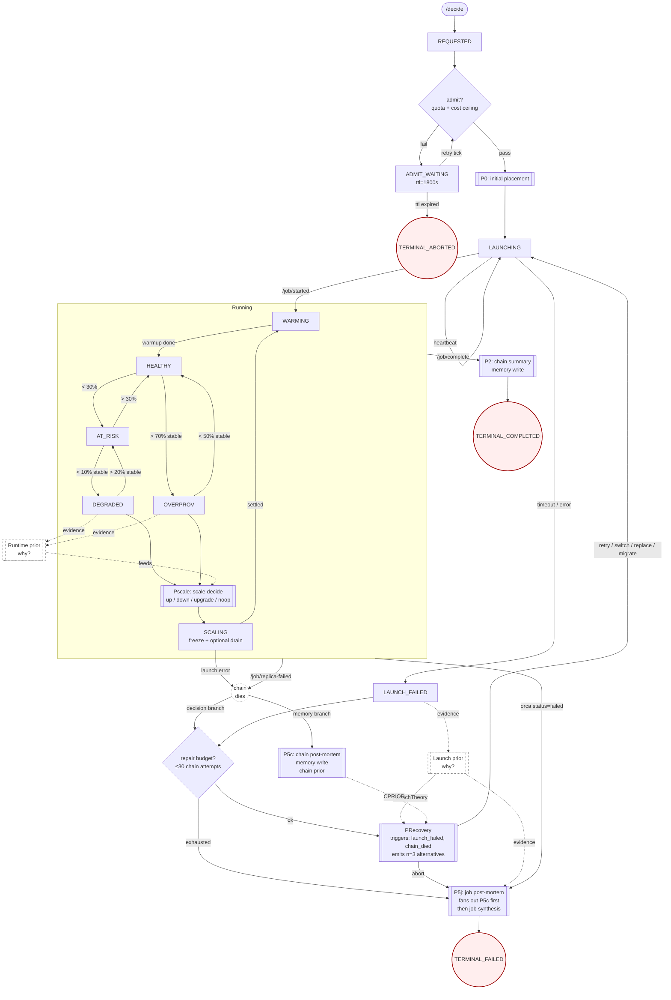

# Koi Harness Architecture v0

**Goal:** migrate Koi's production agent loop from two broad prompts into a small FSM-driven harness that precomputes evidence, presents some recommendations based on cost/slo and lets smaller local LLMs make reliable decisions while encouraging exploration/info-seeking but not mandatorily.

This document describes the target v0 architecture for the live Koi production path. It does not rely on the old ensemble path.

---

## 1. Why This Exists
Koi currently relies on a strong model to read large prompts, decide what tools to call, collect data, do arithmetic, reason about placement/runtime tradeoffs, and finally choose an action. That is workable with strong hosted models, but the production target is a local CPU-capable, heavily quantized LLM. Small local models can reason, but they are weaker at:

- long-context synthesis
- tool orchestration
- remembering API shapes
- doing multi-step arithmetic reliably
- staying inside action policy under pressure

The harness inverts the responsibility:

- deterministic code fetches and compresses evidence
- deterministic code generates feasible recommendations
- deterministic code validates and executes actions
- the LLM reasons over the prepared packet, and can optionally choose to explore.
- the LLM HAS to ultimately generate, using structured generation to, generate the main configuration that we wanna launch + the alternatives that come along with it.

Deterministic code here are actual python functions from the tools themselves present in the V0 non-harness agentic codebase 
Functions like query_memory(), query_perfdb(), get_gpu_physics() are something which, in the V0 architecture was called again and again by the LLM agent. However, making that data available and spoon-fed to an agent seems like the way to go for an FSM like harness design.

The LLM is not reduced to a picker bot. It may inspect packet details, request comparisons, ask for counterfactual menus, and instead of choosing from the recommendations, it ALWAYS has to generate (using structured generation) the final recommendation. The harness constrains what is provided to the LLM and not how the LLM thinks / generates. In fact, the agent is encouraged to reason over a prior (if a chain died/over provisioning) -> and generate a fallback configuration that should launch. We will talk more about this "Theory" thing in the doc below. 

For falling back, it always should add a chain before optionally killing something. That is the scale up / scale down behavior. 

What is in scope for this change?
Here are some states/prompts that need to be made - 
- P0 (initial decision);
- PRecovery (if chain died - try to recover it);
- P5c (if chain died / finished - summary of it);
- P5j (if whole job died / failed to launch with all alternatives - summary of it)
- Deterministic Admission Gate and a queue based architecture - we  only allow certain jobs to come in, if quota/cost-ceiling are reasonable.
- Single-Per-Job Repair Budget - Everytime a certain action (PScale/PRecovery) is called, we deduct one point from the per-job repair budget.
- Recent Failure Awareness - The recommendations provided to the LLM, in the packet, will also have when did this sort of a deployment last fail (cold-delay sort of a thing)

Every time the system has to explain a failure, the agent generates a structured Theory grounded in Orca's raw failure code, the failed job's physics features, and recent memory. Theories are persisted next to decisions and outcomes so the system can learn over time which (theory → action → outcome) triples actually work. This is the foundation for a future causal graph.

---

## 2. Design Principles

### Max Work, Min States
The FSM should stay small. Cluster reality can be messy, but most messiness should live in packet fields, guards, and evidence annotations, not new top-level states. Use durable states for lifecycle and health. Use flags for everything else.

### Spoonfeed Evidence, Preserve Reasoning
The LLM should not have to discover basic facts every time. The packet should already contain:

- workload/SLO/cost constraints
- current runtime state
- PerfDB evidence
- memory outcomes and diagnoses
- model/GPU physics
- quota and beta priors (for availability)
- recent failure signals from fresh failures
- possible feasible actions
- failure theory (from launch/running/chain failures)

The LLM can still ask for more detail, but the default path should require zero external info-seeking.

### Bound Execution, Not Thought
The LLM may reason freely, inspect detail sections, compare options, and disagree with the provided options. It may not invent raw cluster mutations. Final execution happens only through a validated `action_id` that maps to a deterministic executor payload.

### Production Path Only
This architecture targets the live path:

- `koi/server.py`
- `koi/agent.py`
- `koi/monitor.py`
- `koi/runtime_state.py`
- `koi/resource_ledger.py`
- `koi/tools/*`
- `koi/runtime_policy.py`
- `koi/costing.py`

The old ensemble path is out of scope.

### One Failure Per Failure Class
Launch failure and chain death are the same business question: "we just lost a chain; what next?" They share one recovery loop (PRecovery) and one budget. We do not duplicate prompts or budgets per failure subtype. 

### Memory is Both Sides
Memory must be written on success (chain summary) and on failure (post-mortem). A system that only writes failure post-mortems will eventually believe everything fails.

---

## 3. Final v0 FSM

This is the business-level FSM for v0. Do not expand it unless a condition is truly durable and operationally distinct.



The mermaid is a lil older than what all we have, so don't worry about it too much, just here to help you guide through the whole thing.

Each phase that handles a failure generates a one-sentence free-form Theory explaining *why*: LaunchTheory (PRecovery on launch_failed), RuntimeTheory (Pscale on degraded/overprov), ChainTheory (P5c on chain_died). Theories are natural-language hypotheses, not enums — the agent says it in its own words. Every attempt has a theory aligned with it.

The agent generates it whenever the system has to explain "why did something just go wrong?" The agent is creative, but the output is typed.
+----------------------------+-------------------------+---------------------------------------------------------------+
| Phase                      | Theory generated by     | Inputs to the theory                                          |
|                            | agent                   |                                                               |
+----------------------------+-------------------------+---------------------------------------------------------------+
| PRecovery (launch_failed)  | LaunchTheory            | Orca's launch failure category + model physics + memory of    |
|                            |                         | same-model launches                                           |
+----------------------------+-------------------------+---------------------------------------------------------------+
| Pscale (DEGRADED/OVERPROV) | RuntimeTheory           | Telemetry + GPU physics + prediction provenance               |
+----------------------------+-------------------------+---------------------------------------------------------------+
| P5c (chain_died)           | ChainTheory             | Orca's reason_code + failed chain's physics features +        |
|                            |                         | memory of same-scope deaths                                   |
+----------------------------+-------------------------+---------------------------------------------------------------+

Every Theory is persisted with (inputs, theory, action_taken, outcome), and over time you mine it.

### States
There are two kinds of states
1 - Cluster States- it is a fact about the cluster (what is alive)
2 - LLM specific states (which carry a certain prompt with them)

| State | Meaning |
| --- | --- |
| `REQUESTED` | `/decide` accepted and parsed. | (P0)
| `ADMIT_WAITING` | quota/cost not met yet, in queue | (not an LLM State)
| `LAUNCHING` | Launch requested, heartbeat/start/failure pending. | (not an LLM State)
| `LAUNCH_FAILED` | Launch path failed before serving (if all alternatives fail to launch / install failed / OOM) | (PRecovery)
| `WARMING` | Job or replica started, metrics not stable yet. | (not an LLM State)
| `HEALTHY` | Running with enough SLO headroom. | (Deadband + PScale)
| `AT_RISK` | Running below healthy threshold but not yet degraded. | (Deadband + PScale)
| `DEGRADED` | Stable falling-behind condition. | (Deadband + Pscale)
| `OVERPROV` | Stable over-provisioned condition. | (Deadband + Pscale)
| `SCALING` | Scale/kill/migrate action in flight (After PScale is called); monitor freeze applies. | (not an LLM state) 
| `REPLICA_RECOVERY` | A dead chain was diagnosed and recovery decision is needed. | (PRecovery)
| `TERMINAL_COMPLETED` | Job completed. | (P2 in the diagram - Save Chain Summary Per Job)
| `TERMINAL_FAILED` | Job failed after post-mortem. | (P5j or P5c If Chain Died or Job Died.)


Precovery takes care about it's parameters as evidence data for the theories to form
- failed launch attempts, startup logs, quota/capacity/OOM
- Theory Developed from the Prior Evidence is - Why did Startup Fail? 
- And the actions are followed like this - 
# pseudocode, you need to determine what to implement
get_launch_alternatives()
check_fresh_quota()
filter_models_by_physics_vectors()
rank_by_workload_and_gpu_physics(i_o, memory_bandwidth, sm)
add_tool_definitions_to_the_prompt()
generate_more_alternatives_using_agent()
guardrails() # model fits or not 
- The prompt needs to think from the perspective of "oh the availability is not there"/"vllm-param/version failed" etc...
- Two paths when this gets triggered - When Spots Pre-Empt or Machine Dies or all alternatives fail to launch.


### Not States

These should be packet fields, guards, reasons/hypothesis/theory, or evidence that will be provided in a JSON:

# Group 1: Packet inputs (agent reads these)
- quota found/not found
- under/over cost ceiling
- planned vs actual config drift
- exact PerfDB vs proxy vs analytical source
- fresh spot preemption signal
- recent no-capacity failure signal
- tenant id

# Group 2: Guards (control flags, not durable state)
- retry budget remaining/exhausted
- action in flight / cooldown
- metrics stale
- evidence quality flag

# Group 3: Theory outputs (agent emits these, persisted next to decisions)
- LaunchTheory — launch theory (PRecovery on launch_failed)
- RuntimeTheory — runtime theory (Pscale)
- Chain Theory - 

# Group 4: Evidence labels (annotations on suggestion cards)
- recent failure recommendation strings

ClusterStates according to me are - 

class ClusterState(str, Enum):
    REQUESTED          = "requested"          # /decide accepted
    ADMIT_WAITING      = "admit_waiting"      # quota/cost not met yet, in queue
    LAUNCHING          = "launching"          # Orca submit in flight
    WARMING            = "warming"            # model_ready signal, metrics not stable
    HEALTHY            = "healthy"            # SLO headroom OK
    AT_RISK            = "at_risk"            # below healthy band, no action
    DEGRADED           = "degraded"           # stable below SLO
    OVERPROV           = "overprov"           # stable above headroom band
    SCALING            = "scaling"            # action in flight, monitor frozen
    TERMINAL_COMPLETED = "terminal_completed"
    TERMINAL_FAILED    = "terminal_failed"
    
And what I really see in LLMStates are - 

class DecisionPhase(str, Enum):
    P0          = "p0_initial_placement"
    PRECOVERY   = "precovery"          # launch_failed or chain_died
    PSCALE      = "pscale"
    P5C         = "p5c_chain_postmortem"
    P5J         = "p5j_job_postmortem"
    P2          = "p2_chain_summary"   # success-side summary

What kicks each DecisionPhase

| DecisionPhase | Trigger                                | Agent reads                                 | Agent emits          | Persists                                           |
|---------------|----------------------------------------|---------------------------------------------|----------------------|----------------------------------------------------|
| P0            | REQUESTED after admission              | job_context, memory, perfdb, physics        | (no theory)          | decision row                                       |
| PRecovery     | LAUNCH_FAILED or /job/replica-failed   | failure_context + (P5c diagnosis  )         | action + theory if no diagnosis exists yet | decision row + budget−1      |
| Pscale        | DEGRADED or OVERPROV                   | telemetry, physics, perfdb, memory          | RuntimeTheory               | decision row + theory_blob + budget−1 if scale-up  |
| P5c           | /job/replica-failed                    | Orca reason_code + chain physics + memory   | P5c diagnosis (theory shape) | outcome row + cooloff signal + theory_blob |
| P5j           | terminal failure / budget exhausted    | all decision/theory rows + final outcome    | job-level theory     | outcome row + theory_blob                          |
| P2            | /job/complete success                  | observed metrics + decision history         | (none; optional short reflection) | chain_summary row                     |
---

## 3.1 - Vocabulary Map
The first version and the second versions were VibeCoded, hence it is high time we freeze the naming scheme such that we don't confuse things ever - 

+---------------------+-------------------------------------------------------------+----------------+
| FSM diagram name    | Code module                                                 | Doc symbol     |
+---------------------+-------------------------------------------------------------+----------------+
| Initial Placement   | koi/harness/p0.py                                           | P0             |
| PRecovery           | koi/harness/precovery.py (was p1.py + p4.py)                | PRecovery      |
| Pscale              | koi/harness/pscale.py                                       | Pscale         |
| Chain Post-Mortem   | koi/harness/chain_postmortem.py (was p5c.py)                | P5c            |
| Job Post-Mortem     | koi/harness/job_postmortem.py (was p5j.py)                  | P5j            |
| Chain Summary       | koi/harness/p2.py (NEW)                                     | P2             |
| DeadBand            | koi/monitor.py hysteresis bands + anti-windup               | DeadBand       |
| ResourceMap         | koi/resource_ledger.py (rename to resource_map.py)          | ResourceMap    |
| JobID               | job_id                                                      | JobID          |
| ChainID             | chain_id (NEW first-class column)                           | ChainID        |
+---------------------+-------------------------------------------------------------+----------------+

## 4. High-Level Harness Flow

Every LLM decision follows the same outer pipeline:

Here is one example - 
Trigger: DEGRADED detected for job=J1
  -> StateReducer:    cluster=DEGRADED phase=PSCALE
  -> PacketBuilder:   build_runtime_context(J1) + recent_failure_signals
  -> LLMReasoner #1:  reasons over packet, takes in Telemetry etc -> emits RuntimeTheory  
  -> SuggestionBuilder: 5 candidates, ranking will be done based on Physics / certainity
  -> PromptTemplate:  pscale.j2 (state=DEGRADED, theory=RuntimeTheory(...), failed_suggestions=...)
  -> LLMReasoner #2:  emits ChosenAction(plan=..., alternatives=[...], rationale=...)
  -> Guardrail:       ConfigValidator OK, ActionGate OK
  -> Executor:        Orca scale-up submit
  -> Recorder:        decisions row + RuntimeTheory/runtimetheory blob + budget −1

| Stage | Responsibility |
| --- | --- |
| `StateReducer` | It is a trigger classifier, finds you what FSM state does this belong to. |
| `PacketBuilder` | Pull deterministic evidence into a transition packet. By Packet - I mean a couple of JSON Dicts that can be passed to the LLM in a structured format. |
| `PriorReasoner` | Agent stage. Reads the packet, runtime telemetry, physics, and
                    memory; emits a one-sentence free-form RuntimeTheory describing *why* the transition
                    likely happened. The agent is encouraged to be creative — the prior
                    is NOT deterministic. Only fires for DEGRADED / OVERPROV (Pscale).
                    In future versions, multi-agent debate over priors will feed a
                    causal graph mapping (prior → action → outcome) so the system
                    can learn which beliefs predict which fixes. |
| `SuggestionBuilder` | Pre-filter infeasible options and show some suggestions to the Agent. This is a Guardrail even before it goes to the LLM.|
| `PromptTemplate` | Render a small state-specific prompt from the packet. "Objective is to handle failure -> here are resources..... and some recommended options. Please generate the final configuration"|
| `LLMReasoner` | Let the model inspect packet details and do the final action / generate a launch config (structured generation)|
| `Guardrail` | Formerly Validator - Guardrail checks the output shape, safety, and compliance with the Quota Map. If the LLM Hallucinated, and the quota/availability changed, it is just some simple IF ELSE conditions |
| `Executor` | Map action id to current production operations. |
| `Recorder` | Write decisions, outcomes, diagnoses, recent failure signals, and events. |

---

## 5. State Ownership in v0 

Do not add a second authoritative FSM database in v0. Derive state from current production sources. We will make that DB in the next version. 

| Harness State | Existing Source |
| --- | --- |
| `REQUESTED` | `/decide` request path. |
| `LAUNCHING` | `MonitoringLoop._pending_launches` and runtime `pending_launches`. |
| `WARMING` | `JobTracker.status == warming_up`. |
| `HEALTHY` | `JobTracker.status == on_track`. |
| `AT_RISK` | `JobTracker.status == at_risk`. |
| `DEGRADED` | `JobTracker.status == falling_behind`. |
| `OVERPROV` | `JobTracker.status == over_provisioned`. |
| `SCALING` | `JobTracker.action_in_progress` / `action_freeze_until`. |
| `REPLICA_RECOVERY` | `/job/replica-failed` handler context. |
| `TERMINAL_COMPLETED` | `/job/complete`. |
| `TERMINAL_FAILED` | launch/job failure after post-mortem. |
| `TERMINAL_ABORTED` | deterministic admission abort or LLM-selected abort. |

Explicit FSM tables can be added later for audit/replay if needed, but they are not required for v0. Early persistence should focus only on targeted data:

- retry budgets
- recent failure signals
- optional packet/choice audit rows if debugging requires them

---

## 6. New Module Layout

```text
koi/harness/
  __init__.py
  schemas.py
  fsm.py
  controller.py
  packets.py
  suggestions.py
  prompts.py
  reasoner.py
  guardrail.py         # action_id guardrail, formerly part of validator.py, not sure if it needs its own file
  config_validator.py  # raw config validation, split from validator.py
  executor.py
  cooloff.py
  p0.py
  precovery.py         # launch recovery, was p1.py plus merged p4.py logic
  pscale.py
  p2.py                # chain summary logic (once chain finishes successfully)
  chain_postmortem.py  # chain (P5c) diagnosis logic
  job_postmortem.py    # job (P5j) diagnosis logic
  admission.py         # queue and admission gate
  budget.py            # repair budget counter
  theories.py          # LaunchTheory, RuntimeTheory, and theory builders
  resource_map.py      # resource accounting (renamed from resource_ledger.py) - not really needed to modify right? 
```

### Suggested Responsibilities

| Module              | Responsibility |
|---------------------|------------------------------------------------------------------------------------------------------------------------------------------------------------------------------|
| `schemas.py`        | Pydantic models for packets, action options, tools for exploration, choices (suggestions), prompt outputs.                                                                   |
| `fsm.py`            | State reducer and transition helpers. Derived-state only in v0; no DB, just per-job in-memory state logic.  # i think it can be moved with controller.py                     |
| `controller.py`     | Orchestrates packet → suggestions → prompt → reasoner → guardrail/config validation → execute. Primary agent system runner.                                                  |
| `packets.py`        | Shared packet-building utilities and detail section management.  # please define packets and section management more                                                         |
| `suggestions.py`    | Produces suggestions for the LLM, using PerfDB/memory. Used to present plausible and successful historical sample actions.                                                   |
| `prompts.py`        | System prompt and micro-prompt templates for each scenario/state.                                                                                                            |
| `reasoner.py`       | LLM invocation, structured/typed output generation, packet-scoped read tools. The agent "thinking" step. For now it can use openrouter, but next step is adding runner too   |
| `guardrail.py`      | Validates the selected `action_id` (safety, quota, policy). Fails open only for valid, feasible actions. # i think you can fuse guardrail and config validator               |
| `config_validator.py` | Validates generated configs for shape/safety/compatibility. Ensures output can be safely executed.                                                                         |
| `executor.py`       | Deterministic mapping from action_id to production operation. Executes actions.  # this is where expl / action tools are called                                              |
| `cooloff.py`        | Handles recent failure signals, timestamps, and brief resource cooling logic on failed chains.                                         |
| `p0.py`             | Initial placement: packet, suggestion, prompt logic.                                                                                   |
| `precovery.py`      | Launch and replica recovery logic (merged p1 logic and former p4 replica recovery).                                                    |
| `pscale.py`         | Runtime scale (up/down/upgrade/noop) logic.                                                                                            |
| `p2.py`             | Chain summary generation, memory writes (terminal summary).                                                                            |
| `chain_postmortem.py` | P5c: chain-level postmortem and diagnosis logic.                                                                                     |
| `job_postmortem.py`   | P5j: job-level postmortem and diagnosis logic, including fan-out to chain_postmortem.                                                |
| `admission.py`      | Admission and gating logic, pre-queue and waiting queue.      # i am not sure if its needed now to have a separate file                                                      |
| `budget.py`         | Repair/retry budget tracking and decision.                                                                                             |
| `theories.py`       | Defines LaunchTheory, RuntimeTheory schemas and their construction helpers/builders.                                                                                         |
| `resource_map.py`   | Resource accounting, available and used pool bookkeeping (formerly koi/resource_ledger.py).    # again im not sure if we need to edit existing logic/file                    |

Each prompt file should share logic and structure via common helpers where possible.

---

## 7. Core Schemas

### TransitionPacket

One shared outer packet shape should feed all prompts.

```python
class TransitionPacket(BaseModel):
    packet_id: str  # not necessarily required (for future when we have DB)
    job_id: str
    tenant_id: str = "default"
    state: ClusterState  # current state of the job/chain (matches §3 FSM enum)
    phase: DecisionPhase  # prompt/transition phase (DecisionPhase, not TransitionType)
    job_context: dict  # the original job-level details
    runtime_context: dict = {}  # live fleet state
    failure_context: dict = {}  # included on raw failure as well as post-mortem
    policy_context: dict = {}
    evidence_summary: dict  # prior made by the LLM
    action_options: list[ActionOption]  # list of up to 3 options (n=3 contract)
    detail_sections: dict[str, Any]
    guards: dict[str, Any]
```

```python
job_context = {
    "job_id": "mo-qwen-123",         # Koi side ID
    "group_id": "mo-qwen-123",       # Orca side ID
    "decision_id": "dec-abc123",     # Koi Internal ID per decision
    "parent_decision_id": "dec-root",# created by koi for that JOB Group
    "model_name": "Qwen/Qwen3-32B",
    "avg_input_tokens": 512,
    "avg_output_tokens": 512,
    "num_requests": 5000,
    "total_tokens": 6_000_000,
    "slo_deadline_hours": 2.0,
    "objective": "cheapest",
    "cost_roofline_usd": 25.0,       # from user, not from the roofline analysis model that's in LLMPlacementSolver
    "preferred_market": "spot",      # from user
    "quantization": "fp8"            # user preference, often disabled for most cases
}

# or

job_context = {
    "job_id": "mo-qwen-123",
    "parent_decision_id": "dec-original",
    "model_name": "Qwen/Qwen3-32B",
    "slo_deadline_hours": 2.0,
    "objective": "cheapest",
    "original_config": {
        "gpu_type": "L40S",
        "tp": 4,
        "pp": 1,
        "dp": 1
    }
}
```

### ActionOption

Each action option is executable only through a deterministic payload reference. Always up to 3 per n=3 contract.

```python
class ActionOption(BaseModel):
    action_id: str
    action_type: str
    summary: str
    rank: int
    valid: bool
    hard_feasibility: dict
    performance: dict
    physics: dict
    evidence: dict
    availability: dict
    cost: dict
    risk: dict
    executor_payload_ref: str
    detail_refs: list[str]
```

### LaunchTheory

One-liner string hypothesis about launch failure, rationale, or context.

```python
class LaunchTheory(BaseModel):
    hypothesis: str  # natural language hypothesis: succinct, one-liner
    confidence: float  # 0.0–1.0, expected probability/confidence
    evidence: str  # supporting facts/trace
```

### RuntimeTheory

One-liner string hypothesis about runtime anomaly/failure.

```python
class RuntimeTheory(BaseModel):
    hypothesis: str  # natural language hypothesis: succinct, one-liner
    confidence: float
    evidence: str
```

### RepairBudget

Tracks repair/retry budget, current usage, and what actions consume it.

```python
class RepairBudget(BaseModel):
    cap: int
    used: int
    remaining: int
    consumed_by: list[str]  # action names/types
```

### AdmissionDecision

Outcome of admission controller.

```python
class AdmissionDecision(BaseModel):
    outcome: Literal["admitted", "queued", "rejected"]
    reason_code: str
    ttl_remaining: int  # seconds remaining in hold/queue if relevant
```

### ChosenAction

The final LLM output should be generated using structured generation, with the ability to inject a supporting theory. The LLM is NOT a strict re-ranker, and has full authority to use available evidence or propose its own valid choice.

```python
class ChosenAction(BaseModel):
    action_id: str
    confidence: float
    rationale: str
    evidence_used: list[str]
    why_not_top_choice: str | None = None
    requested_more_context: bool = False
    theory: LaunchTheory | RuntimeTheory | None = None
```

---

## 8. Packets Always Visible to the Agent

Each packet contains two evidence layers.

### Theory / Fact-Based Features

These features are always visible to the prompt, and are intended to be short and decision-ready. (A future orchestration or policy engine may apply its own rules to these per-cluster, but for now their set is fixed.) The following are considered MUST-have features:

- hard feasibility
  - `vram_fit`
  - `vram_headroom_gb`
  - `tp_heads_valid`
  - `pp_layers_valid`
  - `kv_heads_per_tp_shard`
  - `crosses_node_boundary`
  - `capacity_ok`
  - `runtime_supported`
- performance
  - `predicted_tps`
  - `required_tps`
  - `meets_slo`
  - `prediction_source`
  - `prediction_confidence`
- physics
  - `bandwidth_per_param`
  - `flops_per_param`
  - `roofline_decode_tps`
  - `io_ratio`
  - `gqa_ratio`
- evidence
  - `proxy_model`
  - `proxy_distance`
  - `memory_successes`
  - `memory_failures`
- availability
  - `live_quota`
  - `beta_launch_success_pct`
  - `recent_no_capacity_failures`
  - `recent_same_scope_failure`
  - `last_failure_age_min`
  - `recent_failure_reason`
- cost
  - `cost_per_hour`
  - `projected_total_cost_usd`
  - `under_roofline`

### Detail Sections
# have to think a little here before jumping through

The detail sections store rich evidence that the LLM can inspect when needed. This is where the 130+ PerfDB/memory variables belong.

Examples:

```text
physics:<action_id>
perfdb_exact:<action_id>
perfdb_proxy:<action_id>
memory_success:<action_id>
memory_failure:<action_id>
quota:<action_id>
recent_failures:<action_id>
runtime_metrics:<action_id>
```

By default, the LLM does not receive all detail sections up front. It is given only section references, and may use read tools to pull deeper context as needed.

### Theory Output
When the agent makes a decision, it emits a structured theory (such as `RuntimeTheory`) back into the packet. This theory output is used downstream—for example, feeding Pscale’s next decision via memory. The theory acts as a concise hypothesis about runtime anomalies or decisions, carrying forward critical reasoning and evidence for subsequent phases.


---

## 9. Physics Strategy

Physics is first-class deterministic evidence. It should not be left for the LLM to dig into. Everytime, there is any kind of a decision that the LLM Agent needs to make it should follow the following framework. 

All packet builders should do this - 

1. Fetch model features through `koi.tools.physics.get_model_features()` for the model we are trying to deploy. 
2. Compute the physics vector for the requested model. An example is shown below

// For Qwen/Qwen2.5-72B-Instruct:
//
//   physics_vector = {
//     "params_billion": 72,
//     "model_size_gb": 140,            // Model file size
//     "gpu_bandwidth_gbps": 2.4,       // Candidate GPU
//     "gpu_tflops_fp16": 240,
//     "bandwidth_per_param": 0.033,    // Derived: memory bandwidth per model param
//     // ...other relevant features
//   }


3. Query exact PerfDB records first.
4. If exact coverage is sparse or absent, run physics-vector similar-model fallback with `find_similar_models()`.
5. Compute per-config features with `koi.model_features.compute_config_features()`.
6. Assign prediction source and confidence. (We are assigning a heuristic here)
7. Build option cards with physics summaries plus rich detail sections.

The heuristic can be designed in this way - 
- Memory verified (is the same run already done in the memory) - (physics_similarity)*0.9 
- Found exact workload in PerfDB - (physics_similarity)*0.8
- Found a close match using Physics - (physics_similarity)*0.7

physics_similarity should be a number that can be normalized between 0 and 1, and for the first 2 cases it will be closer to 1 and the third case will be less closer to 1. Since it is a vector distance between what we have vs what we have observed. 


---

## 9.5. Suggestions are NOT GROUND TRUTH, and LLM is not a card picker

PerfDB Exact matches should ALSO NOT be considered the ground truth. Even exact matches can drift due to vLLM version, CUDA/driver changes, model-serving changes, kernel changes, AMI/image changes, workload shape, or cloud hardware variance. The LLM may accept, modify, or reject suggestions after inspecting evidence, but ultimately it should generate the configuration itself using structured generation. Not just for the primary configuration, but also the alternatives that Koi provides to Orca, should also be generated by the LLM.

Determinism means reproducible evidence construction, safety validation, and execution mapping. It does not mean the current deterministic ranker owns the final placement policy.

The decision contract requires that the LLM outputs not only the primary recommendation, but also fully structured n=3 typed alternative configurations. These alternatives must be independently and explicitly generated, each with their own detailed reasoned spec and supporting evidence in the output, rather than merely an index or pointer to a suggestion. 


---

## 10. Recent Failure Evidence

Long-term beta priors are useful but too slow for fresh failure avoidance. Add short-horizon recent-failure evidence, not hard cooldown enforcement. It is more like a "time-stamp" and not really a hard timer. 

### Why

If `A100 spot us-east-1` was preempted minutes ago, the next decision should know that immediately. This is not just a long-term prior update; it is a fresh operational risk. However, v0 should avoid arbitrary rules like "block this for 30 minutes" because the failed scope may still be the only SLO-saving path. It is a "Soft-check" for the agent to not IMMEDIATELY generate the SAME configuration again.

### Scope

For spot/no-capacity failures, key recent failure signals by:

```text
gpu_type + instance_type + region + market
```

For OOM/performance-specific failures, optionally include (other than the above):

```text
tp + pp + dp
```

### Behavior

- `P5c` writes when a scope failed, why it failed, and what scope it applies to.
- The phases `P0`, `PRecovery`, `Pscale`, and `PRecovery (chain recovery)` (previously referred to as `P1` and `P4`) each incorporate recent failure evidence into their ranking process.
- Keep options valid unless they are truly infeasible (`no_quota`, invalid topology, confirmed unchanged OOM, etc.).
- Deterministically downrank same-scope recent failures instead of hard-blocking them.
- Surface the failure evidence directly on the card: `last_failed_at`, `age_minutes`, `diagnosis_code`, `same_scope`, and `recommendation`.
- Let the LLM choose a recently failed scope if it is still the only viable SLO-saving path.
- Do not globally blacklist a GPU family because one market/region/scope failed.

The persisted table's intended semantics are recent-failure signals and ranking evidence, and NOT rigid cooldown timers.

Example card annotation:
 
```json
{
  "recent_failure": {
    "same_scope": true,
    "last_failed_at": "2026-04-27T21:43:00Z",
    "age_minutes": 7,
    "diagnosis_code": "spot_preemption",
    "recommendation": "Prefer on_demand or another GPU if available"
  }
}
```

---

## 11. Prompt and Tool Policy

### Shared System Prompt

All micro-prompts should share a small system prompt:

```text
You are Koi's bounded decision agent. Start from the provided suggestions and evidence. The ranking is guidance, not a command. You may inspect packet details using the tools that are available to you. Additionally you may choose to explore as well and find more evidence for your decision / placement.
```

### Runner Behavior

- Use typed final output. We need to make sure it is structured generation. LLM Cannot just output a JSON without guardrails/structured generation.
- Despite suggestions and data available for the model, it should STRIVE to explore/reason before ultimately spitting out the final structure.
- If the agent needs more data, it queries more and should use the tools at its disposal.
- Use `max_iterations=3` for `P0`, `PRecovery`, and `Pscale`.
- Use `max_iterations=2` for `P5c` and `P5j`.
- Accept valid non-top choices and log them.
- Fall back only on invalid, unsafe, stale, or timed-out outputs.

### Packet-Scoped Read Tools

Expose tools like:

```text
read_option_detail(action_id, section)
compare_options(action_ids, lens)
read_packet_section(section_id)
request_counterfactual(goal, constraints)
```

These tools let the LLM explore without forcing it back into raw global tool orchestration.

### Per-Prompt Tool Gating

| Prompt      | Tools                                                        |
|-------------|--------------------------------------------------------------|
| `P0`        | Packet read tools and quota detail. No action tools.         |
| `PRecovery` | Packet read tools, quota detail, failure/prior detail. Can choose to launch |
| `Pscale`    | Packet read tools, runtime detail, optional scale/kill escape hatch. |
| `P2`        | Read-only only, optional reflection.                         |
| `P5c`       | Read-only only.                                              |
| `P5j`       | Read-only only.                                              |

The default executor path should not require the LLM to call action tools directly.

---

## 12. Prompt-Specific Plans

There is already some code written in this repo. However, assume that it is wrong — here is what each stage needs to do.

Conventions used throughout §12:

- Deterministic steps prepare evidence for the agent.
- The agent always generates the final config via structured generation (per §1). Suggestions in the packet are advisory; there is no menu-pick path.
- All decision phases share the n=3 alternatives contract from §15 Phase 3.
- Failure-handling phases (PRecovery, Pscale) emit a one-sentence theory inside the same structured response as the plan — no separate "prior builder" stage. Theories are free-form text (`hypothesis: str`), not enum-typed.

### Admission Gate (deterministic, no prompt)

Triggered by `/decide`. No LLM.

- Run `quota_ok(req)` and `cost_ceiling_ok(req)`. Both pass → P0.
- Either fails → enqueue in `admission_queue`, respond 202 with `request_id` + `queue_ttl_remaining_s`. Cluster state for that job becomes `ADMIT_WAITING`.
- Background poll retries every `KOI_DECIDE_QUEUE_POLL_S` (default 30s); TTL is `KOI_DECIDE_QUEUE_TTL_S` (default 1800).
- On TTL expiry → `TERMINAL_ABORTED` with reason `quota_exhausted` or `cost_ceiling_unreachable`.
- Full implementation details in §15 Phase 2.

### P0: Initial Placement

Triggered by `REQUESTED` after admission succeeds.

Packet builder (deterministic):

- parse workload / SLO / cost constraints, fetch resources from ResourceMap.
- query memory outcomes + exact PerfDB; if neither hits, run physics-vector proxy fallback.
- score each candidate: `match% = (model_physics_match) * (gpu_physics_vector_match) * (io_match)`. Normalize TPS by DP.
- annotate every candidate with quota, priors, recent-failure signals, and `dollars_per_token_estimate`.

Plan shape:

- A plan is a list of **homogeneous groups** `{config, replica_count}`, ordered by `$/token` ascending.
- Each group is internally homogeneous (same GPU, TP, PP, market, region, engine_config). Different groups in one plan may differ.
- The launcher walks groups progressively; SLO is checked after each group; launching stops as soon as predicted aggregate TPS clears `required_tps`.
- For unknown models (physics fallback only), keep `replica_count` small (often 1) per group so Pscale can correct from observation.

Agent configuration generator:

The deterministic packet is passed to the agent. The agent always generates the final config via structured generation. The agent is encouraged to explore tools freely and reason; it does not pick from suggestions.

Example plan the agent emits — a list of homogeneous groups ordered by `$/token` ascending. LLM-generated fields are everything inside `groups`; deterministic fields are everything below `reasoning` (computed by Koi after the agent emits the plan).

```json
{
  "job_id": "job-abc123",
  "model_name": "Qwen/Qwen2.5-72B-Instruct",
  "config": {
    "suggested_plan": {
      "groups": [
        {
          "group_id": "g1-cheap-spot-l40s",
          "replica_count": 5,
          "gpu_type": "L40S",
          "instance_type": "g6e.12xlarge",
          "num_gpus": 4,
          "tp": 4, "pp": 1,
          "region": "us-west-2",
          "market": "spot",
          "engine_config": { "tensor_parallel_size": 4, "pipeline_parallel_size": 1, "max_num_seqs": 256, "gpu_memory_utilization": 0.9, "dtype": "auto" },
          "predicted_per_chain_tps": 250.0,
          "cost_per_hour_per_chain": 1.20,
          "dollars_per_token_estimate": 1.3e-6
        },
        {
          "group_id": "g2-mid-spot-a100",
          "replica_count": 2,
          "gpu_type": "A100",
          "instance_type": "p4d.24xlarge",
          "num_gpus": 4,
          "tp": 4, "pp": 1,
          "region": "us-east-1",
          "market": "spot",
          "engine_config": { "...": "same shape" },
          "predicted_per_chain_tps": 600.0,
          "cost_per_hour_per_chain": 4.10,
          "dollars_per_token_estimate": 1.9e-6
        }
      ]
    }
  },
  "reasoning": "Cheapest spot L40s first; A100 spot mid-tier. Stop launching when SLO is met.",
  "predicted_aggregate_tps_if_all_launched": 2450.0,
  "required_tps": 2000.0,
  "predicted_total_cost": 25.0,
  "meets_cost_roofline": true,
  "cost_roofline_usd": 50.0,
  "effective_confidence": 0.52,
  "data_source": "exact_match",
  "alternatives": [ "...two more plans, same shape" ]
}
```

Each group is launched as one progressive batch. Within a group all replicas are identical; across groups they differ. The launcher never bin-packs partial replicas across groups.

Executor (progressive launch):

The executor walks the `primary_plan.groups` list in order (already sorted by `$/token` ascending) and launches them progressively. Pseudocode:

```text
launched_chains = []
predicted_aggregate_tps = 0.0

for group in primary_plan.groups:
    # Fire all replicas for this group in parallel via Orca submits.
    # Wait up to KOI_GROUP_LAUNCH_TIMEOUT_S for chains to reach /job/started.
    started_chains = orca.launch_group(
        group,
        per_chain_timeout_s = KOI_GROUP_LAUNCH_TIMEOUT_S,
    )
    launched_chains.extend(started_chains)
    predicted_aggregate_tps += sum(c.predicted_tps for c in started_chains)

    # Greedy SLO check after each group.
    if predicted_aggregate_tps >= primary_plan.required_tps:
        break   # Stop launching. Bank remaining groups (cost savings).

    # If timeout consumed some replicas of this group without them starting,
    # we DO NOT retry within the same group. We move on to the next group.

# Outcomes:
if launched_chains == []:
    # Nothing started across all groups -> escalate to PRecovery (launch_failed).
    invoke PRecovery(trigger=launch_failed)
elif predicted_aggregate_tps < primary_plan.required_tps:
    # Partial fleet: enter WARMING anyway. Pscale will scale up from runtime evidence.
    enter WARMING
else:
    # SLO satisfied at launch time.
    enter WARMING
```

Key behaviors:

- **No bin-packing**: each group is launched whole (parallel submits) but never partial-merged across groups.
- **Per-group timeout**: configurable via `KOI_GROUP_LAUNCH_TIMEOUT_S` (default 600s). If a group asks for N replicas but only M start within the timeout, accept M and move on. Don't keep waiting on the missing `N - M`.
- **Greedy stop**: as soon as predicted aggregate TPS clears `required_tps`, stop launching further groups. Remaining groups are unused (cost saved).
- **Partial fleet is fine**: if all groups exhausted and SLO not met, the started chains still serve. Pscale takes over from runtime evidence and scales up the shortfall.
- **No new repair-budget consumption**: P0's progressive launch is initial-launch, not repair. Per-job repair budget (§15 Phase 1) is untouched here. Budget kicks in only when PRecovery or Pscale runs.
- **Ledger semantics**: every successfully-started chain is credited to ResourceMap on `/job/started`. Submits that timed out without starting are released automatically via the existing 600s pending-reservation TTL.
- **Orca contract**: see §13 for the per-group submit + per-chain start callback contract.

### PRecovery: Unified Failure Recovery

Triggered by `LAUNCH_FAILED` OR `/job/replica-failed`. One prompt, two triggers.

PRecovery always emits a one-sentence `LaunchTheory` inside its structured response, regardless of trigger. The theory is free-form text (a brief natural-language hypothesis, not a closed enum). The trigger only changes which inputs the theory sees:

- on `launch_failed`: theory inputs are Orca's `reason_code` + per-config attempt counts + model/GPU physics + memory of same-model launches. No P5c exists for launch failures.
- on `chain_died`: theory inputs include all of the above plus `P5c.diagnosis_code` + the dying chain's telemetry. P5c's output is one input to the theory, not a substitute for it.

Packet builder (deterministic):

- failed launch attempts: per-config counts and failure categories.
- beta priors and recent-failure signals; original decision context (model exact, PerfDB exact, proxy).
- model physics features and any Orca-provided run stats from failed startups.
- on `chain_died`: also `P5c.diagnosis_code`, `P5c.chain_theory`, `P5c.failure_scope`.
- candidate replacements annotated with quota, priors, recent-failure signals.

Agent configuration generator:

The agent emits one structured response containing both:

- a `LaunchTheory`: one-sentence free-form hypothesis (e.g. *"Spot capacity in us-east-1 dried up; same scope failed twice in the last 10 minutes"*) + `confidence` + supporting `evidence` text. No enum, no fixed vocabulary — the agent says it in its own words.
- a primary recovery plan + 3 alternatives. **Each plan is itself a list of homogeneous groups** (same shape as P0; see §12 P0 example). The launcher applies the same progressive-launch behavior — walk groups in `$/token` order, per-group timeout, greedy stop when SLO is met.

Suggestions are advisory inputs to ranking. The agent generates configs from scratch.

Executor:

- v0 prefers re-decide/recovery through the current Orca flow
- avoid adding a new Koi-originated launch primitive unless needed later
- runs the same progressive-launch loop as P0 (see §12 P0 Executor) over the chosen recovery plan's groups
- on every successful Orca submit produced by PRecovery (one per chain that actually started), decrement per-job repair budget by 1 (§15 Phase 1). Submits that timed out without starting do not consume budget.
- if budget is exhausted, route to P5j with reason `repair_budget_exhausted` and transition to `TERMINAL_FAILED`

### Pscale: Runtime Scaling

Triggered by `DEGRADED` or `OVERPROV`.

Pscale always emits a one-sentence `RuntimeTheory` inside its structured response, alongside the action plan. The theory is free-form text — a brief natural-language hypothesis, not a closed enum.

Packet builder (deterministic):

- runtime state: aggregate observed TPS, required TPS, time left, tokens remaining, current replicas.
- DeadBand state (action freeze / cooldown), cost projection vs `cost_roofline_usd`, recent-failure signals.
- GPU telemetry: cache usage, SM utilization, memory bandwidth, staleness, warmup status.
- model physics + prediction provenance.
- scale up/down/upgrade/noop suggestions (advisory; not picked verbatim).

Agent configuration generator:

The agent emits one structured response containing both:

- a `RuntimeTheory`: one-sentence free-form hypothesis (e.g. *"Observed TPS is 38% below predicted and KV-cache usage is 92% on both replicas — looks like KV-cache pressure, not capacity shortage"*) + `confidence` + supporting `evidence` text. No enum, no fixed vocabulary — the agent says it in its own words.
- a primary scaling action + 3 alternatives, each a fully typed action. Action shape:
  - **Scale up**: `{op: "add_group", group: {config, replica_count}}`. Adds one new homogeneous group to the live plan and runs progressive launch on just that group.
  - **Scale down**: `{op: "remove_replica", group_id: <existing>, count: 1}`. Removes one replica from an existing homogeneous group (preferring sickest replica per RuntimeTheory).
  - **Upgrade/migrate**: `{op: "add_group", group: {…higher-tier…}}` followed by Pscale's next decision to `remove_replica` from the lower-tier group once the upgrade chain is healthy. Modeled as two consecutive scale actions, not one combined op.
  - **Noop**: explicit "do nothing this tick" — useful when DeadBand says wait.

Suggestions are advisory. "Scale-up cheaper config" or "kill one replica" are hints, not commands. The agent generates the action from scratch.

Executor:

- uses current scale / kill production code
- enters `SCALING`
- preserves anti-windup freeze (DeadBand)
- returns to `WARMING` when settled
- on `add_group`: runs the same progressive-launch loop as P0 over the single new group (per-group timeout still applies)
- decrements per-job repair budget by 1 only on **successful Orca submits produced by `add_group`**. Scale-down, drain, and noop do **not** consume budget

### P5c: Chain Post-Mortem

Triggered by `/job/replica-failed` (chain death) or scaling launch error. LLM phase. Runs in **parallel** with PRecovery's `chain_died` branch — P5c writes memory; PRecovery picks the replacement.

Packet builder (deterministic):

- chain config
- actual TPS before death if known
- recent metrics up to death
- Orca's `reason_code` (passthrough; see §10)
- market / region / instance
- previous memory context for the same scope

Output:

- `diagnosis_code` — Orca's `reason_code`, passthrough (Orca's enum, not a Koi belief)
- `chain_theory` — one-sentence free-form hypothesis from the agent (e.g. *"KV-cache pressure on this topology — chain ran fine for 30 min then OOMed once max_model_len traffic spiked"*) + `confidence` + supporting `evidence` text. Same shape as `LaunchTheory` and `RuntimeTheory`. No enum, no fixed vocabulary — the agent says it in its own words.
- `failure_scope` — cooloff scope key (structured, real)
- `event_at` — timestamp
- recent-failure signal fields: `last_failed_at`, `failure_scope`, `diagnosis_code`

Both `diagnosis_code` (Orca's word) and `chain_theory` (Koi's agent's word) become **inputs** to PRecovery's theory on the `chain_died` trigger. P5c does not replace PRecovery's theorizing.

Recorder:

- writes outcome diagnosis and chain_theory
- updates availability priors when appropriate
- writes a recent-failure signal for fresh spot / no-capacity / OOM scopes

### P5j: Job Post-Mortem

Triggered by terminal job failure, repair-budget exhaustion, or abort.

Behavior:

- fan out `P5c` for any undiagnosed dead chains first
- consume LaunchTheory + RuntimeTheory + all P5c diagnoses written for this job
- synthesize a one-sentence job-level diagnosis (free-form text) + a longer free-text narrative
- write job-level outcome and narrative
- transition cluster state to `TERMINAL_FAILED`

No action tools. P5j observes and records; it does not launch anything.

### P2: Chain Summary on Success

Triggered by `/job/complete` success path. Deterministic by default; an optional short LLM reflection is gated behind `KOI_HARNESS_PROMPTS=p2`.

Deterministic stats:

- observed TPS curve (avg, p50)
- cost per hour, total cost
- prediction error (signed delta vs P0's `predicted_tps`)
- warmup duration, runtime hours
- replicas during chain life
- final cluster state at completion
- list of Pscale actions applied to this chain

Optional LLM reflection (≤300 tokens, flag-gated):

- short free-text "what worked, what to remember" note
- not used for any action — purely for memory enrichment and the future causal graph

Recorder:

- writes a `chain_summary` row keyed by `(job_id, chain_id)`
- joinable against decisions and outcomes for `(plan → outcome)` mining
- closes the "memory is both sides" loop from §2

### Recent-failure ranking (shared policy)

All packet builders in §12 must consume recent-failure signals when annotating candidates:

- read active recent-failure rows for each candidate scope
- annotate with `last_failed_at`, `age_minutes`, `diagnosis_code`, `same_scope`
- downrank same-scope recent failures in P0, PRecovery, and Pscale candidate lists
- recently failed scopes stay valid unless they are otherwise infeasible — the agent may override when SLO requires it
- never globally blacklist a GPU family because one scope failed

This is a soft signal, not a hard cooldown. Rollout details live in §15.

---

## 13. Production Integration Points

### `koi/server.py`

Use the harness in these paths behind feature flags:

- `/decide` -> `P0`
- `/job/launch-failed` -> `P1` → `PRecovery`
- `/job/replica-failed` -> `P5c` (parallel) + `PRecovery`
- `/job/complete` -> `P2` chain summary
- terminal job failure -> `P5j`

Keep `_run_with_inbox()` unchanged. It already provides crash-safe event dedup.

### `koi/monitor.py`

Keep deterministic polling, hysteresis, trigger dedup, and anti-windup. Route `FALLING_BEHIND` and `OVER_PROVISIONED` through `Pscale` when the harness flag is enabled.

### `koi/agent.py`

Initially keep legacy paths. Add small flagged branches:

- `decide()` delegates to harness `P0` when enabled
- `handle_trigger()` delegates to harness `Pscale` for health triggers when enabled
- other triggers stay legacy until phases land

Later, after cutover, remove giant prompt builders and legacy parse logic.

### `koi/llm/runner.py`

Add typed final-output support. If typed output plus tools is unsupported by the pinned `pydantic-ai` version, use a two-stage fallback:

1. tool-capable reasoning call
2. final typed extraction call

### `koi/runtime_state.py`

Do not add full FSM tables in v0. Add only targeted persistence if needed:

- retry budget entries
- recent-failure entries (currently stored in the `cooloffs` table)
- optional packet/choice audit entries
- admission_queue table for the waiting queue

### `koi/tools/memory.py`

Reuse existing decisions/outcomes/launch_attempts/availability_priors. Add targeted helpers only if current queries cannot retrieve recent failure/failure-scope data cleanly.  
Add a `chain_id` column and a `theory_blob` JSON column.

### Orca Integration (cross-repo: `Tandemn-orca/`)

This section grounds the Koi ↔ Orca contract in concrete Orca files. The Orca repo lives at `Tandemn-orca/` (sibling of `koi/`). All citations below are file:line in that repo.

#### Contract changes for homogeneous-groups + progressive launch (§15 Phase 6)

The new Koi-side plan shape is `groups: list[{config, replica_count, …}]` ordered by `$/token`. Orca needs to walk groups in order, fire `replica_count` parallel submits per group, wait up to a per-group timeout, accept whatever started, and call back to Koi after each group with `started_count` so Koi can decide whether to continue or skip the rest. Concrete deltas:

**A. Request schema** (`Tandemn-orca/models/requests.py`)
- Add a `GroupSpec` model: `{gpu_type, tp, pp, dp=1, planned_market, replica_count: int, group_timeout_sec: Optional[float]}`. Could subclass `KoiPlacementAlternative` (`models/requests.py:10-17`).
- Add `groups: Optional[list[GroupSpec]]` to `BatchedRequest` (`models/requests.py:20`). Mutually exclusive with `replicas` + `koi_alternatives` (the legacy "one homogeneous group + per-replica fallback" path).

**B. Server entrypoint** (`Tandemn-orca/server.py`)
- New branch in `submit_batch` (`server.py:2000-2384`): if `request.groups` is set, build `List[(config: MagicOutput, replica_count: int)]` and dispatch to a new `launch_progressive_groups(...)` instead of `launch_chunked_replicas`.
- Skip the "merge alternatives into configs[]" step at `server.py:2135-2166` for the new path — it flattens groups into per-replica fallback, which is the wrong semantic.
- Honor `groups` in **both** solver branches (`user_specified` and `roofline`); currently `koi_alternatives` is only honored by `user_specified`.

**C. Launcher** (`Tandemn-orca/orca_server/launcher.py`)
- Replace or wrap `launch_chunked_replicas` (`launcher.py:822-1058`) with a per-group outer loop:
  1. For each group, compute `group_id = f"{parent_job_id}:g{idx}"`.
  2. Pre-register replicas in `cm` with that `group_id` (today `cm.set_replica_state` carries no `group_id` field — `launcher.py:911-913`; needs adding).
  3. Spawn `replica_count` threads, each calling a slimmed `_launch_chunked_replica` with **a single config** (the inner `for j, cfg in enumerate(configs)` fallback loop at `launcher.py:922` collapses to one iteration — fallback is now group-level, not replica-level).
  4. Wait up to `group_timeout_sec` on a `threading.Event` set as replicas reach `phase=model_ready` (signaled via `_notify_koi_replica_ready` at `server.py:894-951`).
  5. On timeout: tear down still-launching replicas via `sky_down_with_retry(replica_id)` (already imported at `launcher.py:35`) and emit `/job/group-complete`.

**D. New webhooks**
None of these exist today — all would be new emissions through `_post_koi_webhook`:

| New webhook | Trigger | Payload |
|---|---|---|
| `/job/group-launching` | start of each group | `job_id`, `group_id`, `group_index`, `target_count`, `config_summary` |
| `/job/group-complete` | end of group's launch window (timeout or all-started) | `job_id`, `group_id`, `group_index`, `target_count`, `started_count`, `accepted_replicas: list[replica_id]`, `failed_replicas: list[{replica_id, reason_code, reason}]`, `elapsed_seconds` |
| `/job/group-skipped` | Koi told Orca to skip remaining groups (SLO satisfied early) | `job_id`, `group_id`, `group_index`, `reason: "slo_satisfied_early"` |

`/job/group-complete` is the central new hook — it tells Koi how many chains actually started so Koi can decide to skip remaining groups or move to the next one. Emit through `launcher.py:_post_koi_webhook` with dedup key `f"group_complete:{group_id}"`.

**E. `group_id` widening**
Existing webhook payloads already carry `group_id` (`launcher.py:255, 890, 1252, 1299`; `server.py:925, 1262, 1537`) but `group_id == parent_job_id` today. Widen to a sub-job identifier (e.g. `f"{parent_job_id}:g{idx}"`). Backward compatible — existing single-group jobs still work with `group_id` matching `parent_job_id`.

**F. ClusterManager state** (`Tandemn-orca/orca_server/job_manager.py`)
Add `group_id` and `group_index` fields to replica state. Update `cm.get_replica_states(job_id)` callers (e.g. watchdog at `Tandemn-orca/orca_server/watchdog.py:79, 130-141, 183`) so they can filter by group.

**G. Per-group timeout plumbing**
Add a new constant alongside `REPLICA_DEAD_THRESHOLD_SEC` in `Tandemn-orca/orca_server/config.py:54-57`:

```python
KOI_GROUP_LAUNCH_TIMEOUT_SEC = int(os.environ.get("KOI_GROUP_LAUNCH_TIMEOUT_SEC", "600"))
```

Allow override per group via `GroupSpec.group_timeout_sec`. Default 600 s — matches Koi's `KOI_GROUP_LAUNCH_TIMEOUT_S` (§14).

**H. `ReasonCode` extensions** (`Tandemn-orca/orca_server/koi_contract.py:30-43` and the mirrored `koi/koi/contract.py`)
Add two values for the new path:

```python
GROUP_LAUNCH_TIMEOUT = "group_launch_timeout"
GROUP_SKIPPED_BY_KOI = "group_skipped_by_koi"
```

Both repos must update in lockstep (`koi_contract.py:1-9` requires byte-identical mirror).

#### What does NOT change

- The outbox / dedup machinery (`Tandemn-orca/orca_server/outbox.py`) handles new event types transparently — `event_type = event.replace("-", "_")` at `launcher.py:172`.
- The chunked work-queue (`Tandemn-orca/chunk_manager.py`) is independent of how replicas are grouped; chunks are pulled by `replica_id` regardless of group membership.
- `_notify_koi_replica_ready` at `server.py:894-951` continues to fire `/job/started` per replica with `is_fallback` and `decision_id`; it just needs to forward the new `group_id` from `koi_webhook_info` (`launcher.py:888-895`).

#### Standing inconsistency to fix in passing

The watchdog emits `/job/replica-failed` **without** a `reason_code` field (`Tandemn-orca/orca_server/watchdog.py:185-200`). Other emit sites always set one. If Koi is migrating to require `reason_code` everywhere, the watchdog payload needs `"reason_code": ReasonCode.HEARTBEAT_TIMEOUT.value` added. Independent of the groups change but worth landing alongside it.

---

## 14. Feature Flags

Recommended flags:

```text
KOI_HARNESS=0|1
KOI_HARNESS_PROMPTS=p0,precovery,pscale,p5c,p5j,p2      # updated: consistent phase naming, added p2, removed p1/p4
KOI_HARNESS_FAIL_OPEN=1
KOI_HARNESS_MODEL_PROFILE=weak|strong
KOI_HARNESS_MAX_SUGGESTIONS=8                           # renamed from KOI_HARNESS_MAX_MENU
KOI_HARNESS_N_ALTERNATIVES=3                            # NEW: strict n=3 contract for alternatives
KOI_MAX_CHAIN_ATTEMPTS=30                               # NEW: per-job repair attempt budget
KOI_DECIDE_QUEUE_TTL_S=1800                             # NEW: admission queue time-to-live (seconds)
KOI_DECIDE_QUEUE_POLL_S=30                              # NEW: queue polling interval (seconds)
KOI_GROUP_LAUNCH_TIMEOUT_S=600                          # NEW: per-group timeout for progressive launch (P0 / PRecovery / Pscale add_group)
```

`KOI_HARNESS_HETEROGENEOUS` is removed — the system uses homogeneous-groups + progressive launch unconditionally (see §15 Phase 6).

---

## 15. Phased Execution Plan

Foundation-first: vocabulary and identity before contracts, contracts before behavior changes, behavior changes before cutover. Each phase is independently shippable behind its own flag.

| Phase | Lands | Primary test gate | Flag(s) |
|---|---|---|---|
| 0. Vocabulary + PRecovery merge | Rename `p1.py`+`p4.py` → `precovery.py`; rename `p5c.py`→`chain_postmortem.py`, `p5j.py`→`job_postmortem.py`, `resource_ledger.py`→`resource_map.py`; rename `_classify_status_with_hysteresis`→`_classify_status_with_deadband` (+ `DeadBand` wrapper). Mechanical only. | Full unit + sim suite green with no functional change. | — |
| 1. Chain identity + repair budget | Add `chain_id` column to `decisions`/`outcomes`/`launch_attempts`. Add `count_chain_attempts(job_id)`. Replace `MAX_STARTUP_RETRIES`/`P1_RETRY_BUDGET`/`P4_RETRY_BUDGET` with one per-job cap. Decrement only on real Orca submits and scale-up. Exhaustion → P5j → `TERMINAL_FAILED`. | Sim runs PRecovery 30 times for one job; 31st transitions to `TERMINAL_FAILED`. Scale-down does not consume budget. | `KOI_MAX_CHAIN_ATTEMPTS=30` |
| 3. n=3 alternatives + feasibility check | `ChosenAction` requires exactly 3 typed alternatives, validated by `pydantic-ai`. Feasibility checker runs on every emitted config (VRAM / TP heads / PP layers / market availability / cooloff scope). On infeasibility: agent retries up to `max_iterations`, then falls back to top deterministic suggestion. Apply to P0, PRecovery, Pscale. | Schema rejects `len < 3` / `len > 3`; feasibility check rejects bad VRAM/TP/PP; agent converges within retries on test scenarios. | `KOI_HARNESS_N_ALTERNATIVES=3`, `KOI_HARNESS_MAX_SUGGESTIONS=8` |
| 4. Theories (Launch + Runtime) | Add `koi/harness/theories.py` with `LaunchTheory` + `RuntimeTheory`: `{hypothesis: str (one-sentence), confidence: float, evidence: str}`. Free-form, no enum. Extend `ChosenAction.theory` so theory + plan emit in one structured response. PRecovery emits on every trigger; Pscale emits on `DEGRADED`/`OVERPROV`. Persist as `decisions.theory_blob`. | Theory is a non-empty one-sentence string; round-trips through `theory_blob`; `(theory → action → outcome)` triples join cleanly. | — |
| 5. P2 chain summary on success | Add `koi/harness/p2.py: run_chain_summary(job_id, chain_id)`. Deterministic stats by default; optional LLM reflection ≤300 tokens behind flag. Wire into `/job/complete` success path. | Every successful chain has a `chain_summary` row. Memory queries return both success and failure rows for the same model class. | `KOI_HARNESS_PROMPTS=…,p2` (optional reflection) |
| 6. Homogeneous groups + progressive launch | `primary_plan.groups: list[Group]`. Add `koi/harness/group_launcher.py` for the progressive-launch loop (per-group timeout, greedy SLO stop, partial-fleet fallback to Pscale). `Pscale.add_group` runs the same loop on one new group. | Per-group timeout test, greedy-stop test, zero-start test (all groups timeout → PRecovery). | `KOI_GROUP_LAUNCH_TIMEOUT_S=600` |
| 2. Admission gate + waiting queue *(deferred to last)* | `admission_queue` table; `quota_ok` + `cost_ceiling_ok` gates in `/decide`; background poll; TTL → `TERMINAL_ABORTED`. | Queue-and-drain sim, TTL-expiry sim, restart-resume sim. | `KOI_DECIDE_QUEUE_TTL_S=1800`, `KOI_DECIDE_QUEUE_POLL_S=30` |
| 7. Cutover | Shadow mode → per-prompt cutover (`P0` → `PRecovery` → `Pscale` → `P5c` → `P5j` → `P2`). After one release cycle stable, delete the legacy giant-prompt path. | Parity tests green, Tier 3 sim parity, no safety regressions, weak-model quality near strong-model baseline. | `KOI_HARNESS=1` |

Phase 2 is intentionally last — admission queue is the most operationally invasive piece and benefits from everything else being stable first.

### Optional Follow-Ups (deferred)

Land only if v0 observability proves insufficient.

- **Persistent FSM tables** — explicit `decisions × cluster_state` audit/replay. Not needed while derived state from `JobTracker` + `MonitoringLoop` is healthy.
- **Multi-agent theory debate** — a second agent critiques the first's theory before the action call. Foundation for the causal graph; adds a second LLM hop.
- **Recent-failure run-stats ingestion** — Koi-side payload for Orca-provided failed-chain run stats. Useful when `reason_code` granularity is insufficient.

---

## 16. Testing and Verification

### Unit Tests
Do it for major functions inside every phase.


### Simulation

- strong-model parity run
- weak-model run with `xiaomi/mimo-v2-pro`
- launch failure → PRecovery scenario (LaunchTheory emission + n=3 alternatives)
- chain death → P5c (parallel) + PRecovery scenario (ChainTheory + replacement)
- spot preemption recent-failure ranking scenario
- post-mortem coverage scenario
- per-job repair budget exhaustion → P5j → `TERMINAL_FAILED`
- admission queue: capacity arrives mid-TTL → admitted
- admission queue: TTL expiry → `TERMINAL_ABORTED`
- infeasible LLM-emitted config → agent retries → fallback to top suggestion
- successful job completion → P2 writes `chain_summary` row for every chain

### Cutover Gates

- existing test suite green with `KOI_HARNESS=0`
- harness tests green with `KOI_HARNESS=1`
- Tier 3 simulation parity over repeated runs
- weak-model decision quality near strong-model baseline on a fixed scenario suite
- no action safety regressions
- every dead chain has a `diagnosis_code` (from P5c) and a `chain_theory`
- every successfully completed chain has a `chain_summary` row (from P2)
- per-job repair budget enforced (no job exceeds `KOI_MAX_CHAIN_ATTEMPTS`)
- prompt sizes and mandatory tool calls reduced substantially

---

## 17. Observability

Emit structured events:

```text
harness.packet_built
harness.suggestions_built
harness.theory_emitted              # one per LaunchTheory / RuntimeTheory / ChainTheory
harness.alternatives_emitted        # n=3 contract adherence
harness.llm_reasoned
harness.detail_requested
harness.feasibility_check_failed    # LLM-emitted config rejected, agent retrying
harness.fallback_to_top_suggestion  # max_iterations exhausted, safety net engaged
harness.executed
harness.budget_decremented
harness.budget_exhausted
harness.admission_queued
harness.admission_ttl_expired
harness.recent_failure_signal_applied
harness.state_transition
harness.chain_summary_written       # P2 success path
harness.group_launch_started        # one per Group submit (P0 / PRecovery / Pscale add_group)
harness.group_launch_timed_out      # group's per-chain timeout hit before all replicas started
harness.group_launch_complete       # all replicas of the group either started or timed out
harness.slo_satisfied_early         # progressive launch stopped before exhausting all groups
```

Track metrics:

- fallback rate (LLM-emitted config infeasible after retries)
- timeout rate
- detail-tool usage rate
- weak-model success rate
- recovery time (PRecovery latency end-to-end)
- SLO rescue rate
- cost overage
- post-mortem coverage (every dead chain has a P5c diagnosis)
- recent-failure hit rate
- admission queue depth
- admission TTL hit rate
- per-job repair budget remaining (histogram)
- n=3 contract adherence rate
- feasibility check rejection rate
- theory emission rate per phase
- group launch fill rate (replicas requested vs replicas started, per group)
- groups skipped due to early SLO satisfaction (count + cost saved)
- groups exhausted without satisfying SLO (count → handed off to Pscale)

---

## 18. Risks

| Risk | Mitigation |
| --- | --- |
| Tool calls + typed outputs flaky on some `pydantic-ai` versions. | Two-stage fallback: reasoning call, then typed extraction. |
| LLM emits malformed shape (wrong `len`, missing fields). | `pydantic-ai` validates and retries; final fallback to top deterministic suggestion. |
| LLM-emitted config is shape-valid but physically infeasible. | Feasibility check on every emit; retry; fallback to top suggestion. |
| Harness adds latency. | Compact packets, cap suggestions and tool iterations; fallback rather than block. |
| Recent-failure signals over-penalize scarce resources. | Soft downrank only; agent may override when SLO requires it. |
| Repair budget exhausts on noisy spot regions. | Theories steer the agent away from same-scope retries; Pscale prefers on-demand fallback. |
| Free-form theory quality varies model-to-model. | Persist every theory; mine post-hoc; causal-graph follow-up flags bad models. |
| Admission queue starves a job for full 1800 s. | TTL → `TERMINAL_ABORTED` with explicit reason_code; queue depth visible in §17. |
| Dual state sources create bugs. | Derive state from production sources in v0; defer persistent FSM tables. |
| Progressive launch exhausts all groups under SLO. | At least one chain → enter `WARMING`, let Pscale scale up. Zero chains → PRecovery. |
| Per-group timeout too aggressive (abandons recoverable launches). | `KOI_GROUP_LAUNCH_TIMEOUT_S` tunable; watch `harness.group_launch_timed_out` rate. |
| Per-group timeout too generous (waits too long on stuck region). | Same flag, opposite direction. One knob, not a per-region table. |
| Agent emits groups in sub-optimal `$/token` order. | Executor re-sorts by deterministic `dollars_per_token_estimate` before walking. |

---

## 19. End State

The final production decision path should look like this:

```text
Koi / Orca event
-> derived ClusterState  +  DecisionPhase
-> deterministic transition packet (job_context + runtime_context + failure_context)
-> deterministic suggestions (advisory, not picked verbatim)
-> small phase-specific prompt
-> LLM (structured generation) emits in one response:
     - one-sentence Theory (LaunchTheory / RuntimeTheory / ChainTheory)
     - primary plan + 3 typed alternatives
-> feasibility check on every emitted config (retry on fail; fallback to top suggestion)
-> deterministic executor (Orca submit / scale / drain)
-> ResourceMap update + memory write (decision row + theory_blob + outcomes / chain_summary)
-> per-job repair budget −1 if Orca submit happened
```

This gives Koi a harnessed agent loop that is reliable enough for small local models while preserving the useful part of agentic behavior: reasoned, free-form theorizing over rich evidence, with deterministic safety nets around it.
